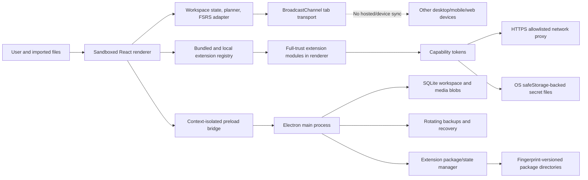

# Neo Anki comprehensive audit — 2026-07-18

Status: remediation-ready audit; no production fixes included
Audit date: 2026-07-18 (Europe/Kyiv)
Core repository: `neoanki/neo-anki` at `08abef4294b9558ee02878d21bc397af94113a5b` (`v0.1.5`)
TTS repository: `neoanki/neoanki-tts` at `6149982151a9ca403b29ace7f78ebd2965dfb1d4` (`v1.0.0`)
Overall Anki-replacement verdict: **Not yet a drop-in replacement**
Immediate UX-superiority verdict: **Promising in daily workload explanation, not demonstrated end to end**

## 1. Executive summary

Neo Anki has a coherent product idea: a local-first study application with a small FSRS kernel, a time-budget planner, restrained review UI, content-addressed media, SQLite persistence, recovery backups, and an unusually explicit extension trust model. The green automated baseline is meaningful. The strongest implementation areas are Electron renderer hardening, basic workspace persistence, guarded review submissions, extension archive path/size validation, HTTPS/domain checks, Linux secret-backend refusal, keyboard-first grading, reduced-motion CSS, and a comprehensible daily time envelope.

The release posture is nevertheless **high risk for migration claims** and **medium-high risk for ordinary preview release use**. No P0 was confirmed, but several P1 defects block a drop-in claim:

- Anki scheduling state and review history are reset, not migrated. Buried cards become suspended, custom templates and CSS are discarded, fields are flattened, and multiple cards per note cannot retain card-level deck identity.
- `.colpkg` is treated as an additive deck import rather than a complete collection replacement, and Neo Anki cannot export an interoperable `.apkg`/`.colpkg` rollback artifact.
- There is no device/web/mobile synchronization service. The bundled “sync” extension is only same-browser `BroadcastChannel` replication and can resurrect deletions.
- FSRS cards due later today are eligible immediately, so short-term learning/relearning steps and exact due times can be violated.
- NeoAnki TTS hashes Base64 text instead of decoded audio bytes. The desktop store rejects the generated asset, leaving generated audio visible in memory but unsavable and causing later workspace saves to keep failing until reload.
- The default catch-all TTS profile shadows every subsequently created profile, and profile order cannot be changed.
- Extension content transactions receive only three array checks, not full schema and invariant validation. A malformed extension result can enter live React state before persistence rejects it.
- Extension reinstall of identical package bytes removes the active package directory before the replacement and registry state are durable, contradicting the documented atomic-upgrade invariant.
- Releases are intentionally unsigned/unnotarized, creating immediate trust friction and OS warning flows that are worse than a mainstream desktop replacement launch bar.

For a **new user with no Anki history**, Neo Anki’s “choose available time → see due/new/buffer → study” flow is clearer than Anki’s deck-option surface. For an **existing Anki user**, that advantage is eclipsed by migration loss, buried import controls, unsigned installation, limited library editing, missing sync, and no safe interoperable exit. Presentation quality must not be used as evidence of compatibility.

## 2. Scope, method, and evidence rules

### 2.1 Scope

This audit covers:

- `neoanki/neo-anki`: kernel, data model, FSRS adapter, planner/session builder, persistence, backup/restore, imports/exports, media, sync merge, React UI, Electron shell, bundled extensions, extension SDK/package CLI, workflows, release configuration, and Study Pulse example.
- `neoanki/neoanki-tts`: configuration, profile matching, text processing, provider adapters, generation, caching/media attachment, review playback, credentials, UI, package, tests, and host compatibility.
- Official public behavior required to evaluate Anki replacement readiness.

The organization website and profile repositories were not code-audited. Only relevant repository/README/release claims were checked.

### 2.2 Evidence classes

| Label | Meaning |
| --- | --- |
| Confirmed | Direct source trace, automated test, or disposable reproduction at the pinned commits. |
| Design risk | The implementation permits a failure, but the exact production failure was not exercised. |
| Gap | Required behavior or validation is absent. |
| Heuristic | Expert UX/accessibility evaluation; no representative-user study was available. |

Severity is impact-based: P0 unrecoverable/catastrophic active failure; P1 release/drop-in blocker or likely serious integrity/security failure; P2 major correctness, pedagogy, accessibility, or operability defect; P3 contained maintainability/polish issue.

### 2.3 External reference baseline

The compatibility standard uses the current official [Anki Manual](https://docs.ankiweb.net/), including [getting started and note/card types](https://docs.ankiweb.net/getting-started.html), [packaged-deck import behavior](https://docs.ankiweb.net/importing/packaged-decks.html), [export and rollback formats](https://docs.ankiweb.net/exporting.html), [sync and media conflict behavior](https://docs.ankiweb.net/syncing.html), [deck options and FSRS](https://docs.ankiweb.net/deck-options.html), [reviewing and sibling burying](https://docs.ankiweb.net/studying.html), [filtered decks](https://docs.ankiweb.net/filtered-decks.html), [leeches](https://docs.ankiweb.net/leeches.html), [templates](https://docs.ankiweb.net/templates/intro.html), [editing](https://docs.ankiweb.net/editing.html), [statistics](https://docs.ankiweb.net/stats.html), and [add-ons](https://docs.ankiweb.net/addons.html).

FSRS integration was checked against the official [`ts-fsrs` project](https://github.com/open-spaced-repetition/ts-fsrs), which exposes four outcomes and separate preview/application calls. Pedagogy was checked against primary or research-review evidence: retrieval practice improves later retention ([Roediger & Karpicke, 2006](https://pubmed.ncbi.nlm.nih.gov/16507066/)); feedback can improve retention and correct metacognitive errors ([Butler, Karpicke & Roediger, 2008](https://pubmed.ncbi.nlm.nih.gov/18605878/)); spacing and retrieval practice have broad support but learners often misjudge effective difficulty ([Carpenter, Pan & Butler, 2022](https://www.nature.com/articles/s44159-022-00089-1.pdf)); and interleaving benefits are task-dependent rather than a universal mixing rule ([Firth et al., 2021](https://strathprints.strath.ac.uk/75711/)).

TTS provider checks use official [OpenAI speech generation documentation](https://developers.openai.com/api/docs/guides/text-to-speech), [ElevenLabs conversion API](https://elevenlabs.io/docs/api-reference/text-to-speech/convert), [Google Cloud Text-to-Speech REST reference](https://docs.cloud.google.com/text-to-speech/docs/reference/rest/v1/text/synthesize), and [Azure Speech REST reference](https://learn.microsoft.com/en-us/azure/ai-services/speech-service/rest-text-to-speech).

### 2.4 Limitations

- The workspace contained no current stable Anki installation and no real user migration corpus. A richer generated legacy fixture was executed, but modern real-world `.apkg`/`.colpkg`, large-media, customized-template, and corrupted-package certification remains missing. This is a release-readiness gap, not evidence of compatibility.
- No real credentials or paid provider endpoints were used. Provider conclusions are source-contract checks plus mocked tests.
- No representative users were timed. “Better UX” conclusions are marked heuristic and based on observable steps, error recovery, keyboard coverage, hierarchy, and accessibility.
- Source review is exhaustive at the pinned commits, but no audit can prove the absence of all defects.

## 3. Architecture and trust boundaries

The renderer is well hardened against direct Node access (`nodeIntegration: false`, context isolation and sandbox enabled, navigation/permission blocking, local protocols, restrictive CSP). This boundary protects the operating system from ordinary renderer compromise. It does **not** isolate one installed extension from another extension or from all workspace data provided to its contributions. The documentation correctly calls local extensions full-trust, but UI permission labels can still be mistaken for a security sandbox.

### 3.1 Compatibility/data-flow matrix

| Flow | Validation before mutation | Atomicity/recovery | Finding |
| --- | --- | --- | --- |
| Review rating | Card ID, reveal/extension guard, grading lock; FSRS transaction | One state update; undo restores prior card | Exact preview differs from fuzzed commit; review event removed on undo. |
| Renderer persistence | Zod shape validation on import/load; incremental diff | Main-process save queue, SQLite transaction | Referential/uniqueness invariants absent; invalid live extension state can repeatedly fail saves. |
| JSON restore | Full semantic parse and SQLite check | Pre-restore backup and replacement | Strongest replacement flow. |
| Anki/CSV import | Parser-level checks; no complete migration schema | Checkpoint just before merge | Anki is lossy; synchronous decompression; collision semantics unsafe. |
| Extension command | Clone plus `items/cards/assets` array checks | Review/settings/trash restored by host | Not a bounded or schema-safe transaction. |
| Extension install | Manifest, paths, counts, compressed/unpacked limits | Temporary directory and registry recovery file | Identical reinstall deletes active target before durable swap. |
| Extension network | Permission, HTTPS host, headers, redirects, timeout, declared sizes | No streaming/circuit breaker | Body fully buffered before actual-size rejection. |
| TTS generation | Provider status and basic attachment shape | Commit after whole batch | Hash incompatible with desktop; no incremental durability. |
| Tab sync | No parse/invariant pass on received snapshot | LWW merge | Deletes can resurrect; no tombstones/conflict recovery. |

## 4. Reproducible validation baseline

### 4.1 Green baseline

| Repository | Command/area | Result at pinned SHA |
| --- | --- | --- |
| Core | lint and TypeScript | Pass. |
| Core | unit/component/Electron-node tests | 23 files, 74 tests pass. |
| Core | browser journeys | 13 pass: 12 Chromium desktop journeys plus 1 Chromium iPhone-emulation journey. |
| Core | runnable Electron journeys | 4 pass: persistence restart, install/disable extension, startup safe mode, WASM Anki import. |
| Core | packaged Electron launch | Skipped locally because `NEO_ANKI_PACKAGED_APP` was not supplied. |
| Core | time-zone runs | 14 tests pass in `America/New_York`; 14 pass in `Europe/Kyiv`. |
| Core | planner benchmark | 50,000 cards in 474 ms; 150 queued, 49,850 deferred; 5 s gate. |
| Core | build, SDK/example validation, licenses | Pass. |
| Core | `npm audit` | 0 reported vulnerabilities. |
| Core | coverage | 89.63% statements, 79.92% branches, 82.85% functions, 95.29% lines—but only `src/lib/**/*.ts`. Storage statements 67.85%/functions 57.14%; sync statements 63.15%/functions 36.36%. |
| TTS | tests | 5 files, 15 tests pass. |
| TTS | typecheck, package check, build | Pass. |
| TTS | Electron journey | 1 pass. |
| TTS | `npm audit` | 0 reported vulnerabilities. |

The browser accessibility journey explicitly disables axe `color-contrast`. Playwright defines Chromium and Chromium-based iPhone emulation only; it does not exercise Firefox/WebKit. TTS coverage is configured but not thresholded and was not part of the recorded baseline.

### 4.2 Disposable and exploratory evidence

| Scenario | Result |
| --- | --- |
| Richer generated Anki package | 2 notes/3 cards imported as 2 items/3 cards, but 2 `revlog` rows became 0 review events; all cards reset to FSRS New/reps 0; 17–30 repetitions were lost; two sibling decks collapsed to the last deck; buried queue `-2` became suspended. Temporary test removed after execution. |
| TTS hash compatibility | Four decoded bytes and their Base64 text produced different SHA-256 values. `generation.ts` uses the latter; `workspace-store.ts` requires the former. |
| Extension package reproducibility | Two unchanged Study Pulse builds one second apart produced SHA-256 `0178c435…` then `f5a9ae99…`. Two unchanged TTS builds produced `b77ecefa…` then `dcc917fb…`. |
| Contrast calculation | Final light `--text-faint` is 3.69:1 on `--surface`; dark is 3.89:1 on `--surface-strong`; dark primary on primary-soft is 4.29:1. These fail 4.5:1 for the small normal text where used. |
| Large library | Existing journey renders 205 items in bounded pages. It is not a large persisted-workspace/import benchmark. |
| Blocking extension | Existing Electron journey confirms the watchdog opens safe mode and logs the timeout. |
| Network, secrets, package failures | Source traced; unit tests cover secret backend and package parsing, but redirect streaming, secret concurrency, and install crash points are not executed. |
| Real provider endpoints | Not called by design; no credentials or paid endpoints used. |

## 5. Anki drop-in replacement readiness

### 5.1 Dashboard

| Capability | Readiness | Gap class | Evidence |
| --- | --- | --- | --- |
| Basic front/back content | Partial | Major parity gap | First two fields become prompt/answer; HTML and template semantics are stripped. |
| Scheduling continuity | No | Drop-in blocker | Every imported card receives `makeEmptyFSRSCard(now)`. |
| Review-history continuity | No | Drop-in blocker | `revlog` is never queried. |
| Modern and legacy archive decoding | Narrow pass | Major parity gap | Tiny classic and zstd/protobuf fixtures pass; no real corpus/version matrix. |
| Note types, templates and CSS | No | Drop-in blocker for established/power users | Models are not preserved; modern normalized models are set to `{}`. |
| Multiple cards per note | Partial/incorrect | Drop-in blocker | Cards are created, but prompt semantics and card-level decks are collapsed. |
| Cloze | Incorrect | Drop-in blocker | All clozes are hidden/revealed together; no per-cloze card rendering. |
| Typed answers | Legacy heuristic only | Major parity gap | Detection relies on legacy template `qfmt`; normalized models are absent. |
| Media | Partial | Major parity gap | Referenced media is imported; no realistic large/collision/missing-media certification. |
| Suspended/buried/flags | Incorrect/absent | Drop-in blocker | Any negative queue becomes suspension; bury distinction and flags are lost. |
| Deck presets/options | No | Drop-in blocker | Not modeled or imported. |
| Browser, bulk editing, filtered decks | No | Major parity gap/power limitation | Library offers substring/collection filtering and single-item editing only. |
| Statistics | Minimal | Major parity gap | Four coarse lifetime metrics and heuristic forecast. |
| Add-ons | Incompatible ecosystem | Power-user limitation | New SDK, no Anki add-on compatibility/marketplace. |
| Desktop/mobile/web sync | No | Drop-in blocker | Same-browser `BroadcastChannel` only. |
| Backup/restore | Strong Neo-native | Neo Anki advantage | SQLite checks, checkpoints and complete Neo backups exist. |
| Interoperable exit | No | Drop-in blocker | CSV omits scheduling/history/media/templates; no Anki package export. |
| Installation trust | No | Drop-in blocker for public mainstream claim | macOS/Windows artifacts intentionally unsigned; manual checksum/override required. |
| Daily workload explanation | Strong heuristic result | Neo Anki advantage | Due/new/buffer and time budget are visible in one view. |
| Review grading language | Strong | Neo Anki advantage | “Forgot / Recalled with effort / Recalled” explains FSRS semantics better than opaque ease labels. |

### 5.2 Field-level migration fidelity

`Preserved` means equivalent usable meaning; `transformed` means explicit non-lossless mapping; `reset` means content exists but progress starts over; `unsupported` means the feature cannot be represented; `silently lost` means no itemized warning identifies the loss.

| Anki field/capability | Neo result | Fidelity | Verification |
| --- | --- | --- | --- |
| Note GUID | `anki-note-<guid or id>` | Transformed | Source trace. |
| Note ID/card ID | Prefixed string IDs | Transformed | Source trace. |
| First field | Plain-text prompt | Transformed | HTML stripped; disposable fixture. |
| Second field | Plain-text answer | Transformed | HTML stripped; disposable fixture. |
| Fields 3+ and names | Joined into one context string | Silently lost structure | Source trace/disposable fixture. |
| HTML, inline styling, entities | Tags removed; only four entities decoded | Silently lost/incorrect | `htmlToText`, lines 11–15. |
| Note type/model | Not stored | Unsupported | Importer never maps it. |
| Front/back templates | Heuristic only; discarded | Silently lost | Legacy `qfmt` read only to detect typed answers. |
| Template CSS/JavaScript | Discarded | Silently lost | Not queried or modeled. |
| Card ordinal | `ord>0` becomes `reverse` unless cloze/typed | Transformed/incorrect | Source trace. |
| Multiple cards per note | Multiple cards created | Partial | Card prompts do not retain individual template semantics. |
| Card-level deck | Writes deck onto shared item; last card wins | Silently lost | Disposable two-deck sibling fixture. |
| Deck hierarchy | `::` becomes ` / ` | Transformed | Source trace. |
| Tags | Space-split tags | Mostly preserved | Fixture. |
| Marked tag | Ordinary `marked` tag only | Transformed | No special behavior. |
| Flags | Not queried | Silently lost | Cards query omits flags. |
| Suspension | Negative queue → suspended | Partial | Suspended preserved, but buried also becomes suspended. |
| User/sibling bury | Negative queue → suspended | Incorrect | Disposable queue `-2` fixture. |
| New/learning/review/relearning state | Empty FSRS card | Reset | All fixture cards state 0/reps 0. |
| Due, interval, factor, repetitions | Queried then ignored | Reset | Importer lines 95 and 133. |
| Review history (`revlog`) | Not queried | Silently lost | 2 rows → 0 events. |
| Learning/relearning steps | Neo global fixed steps | Unsupported | No deck preset model. |
| Desired retention/FSRS parameters | Neo global retention/default parameters | Reset/unsupported | No Anki preset import or optimization. |
| Cloze numbers/hints | Syntax retained in prompt but all deletions rendered together | Incorrect | Prompt extension regex. |
| Typed-answer filters | Legacy `qfmt` heuristic | Partial | Modern normalized models are `{}`. |
| Image occlusion note semantics | Imported as flat text/media | Unsupported | No Anki IO mapping. |
| Referenced media | Content-addressed Neo assets | Transformed | Tiny classic/modern tests. |
| Unreferenced media | Imported into asset list | Transformed | Source trace; no cleanup/ownership report. |
| Deck presets/settings | Not queried | Silently lost | No model. |
| Filtered decks/home decks | Not represented | Unsupported | No model. |
| Custom data/add-on metadata | Not queried | Silently lost | No model. |
| `.colpkg` replacement semantics | Additive `mergeImport` | Incorrect | Same importer path for `.apkg` and `.colpkg`. |

The single generic warning—“legacy interval history is not copied losslessly”—is insufficient. It does not enumerate reset scheduling, dropped history, template/CSS loss, buried conversion, per-card deck collapse, preset loss, or cloze incompatibility.

### 5.3 Persona verdicts

| Persona | Verdict | Rationale |
| --- | --- | --- |
| Basic user | **Conditionally usable only for an unstudied/simple collection; not drop-in** | Plain front/back text and a single desktop can work. Any scheduling history is reset; HTML is flattened; install/import/rollback are not migration-safe. |
| Established user | **No-go** | History, states, presets, cloze fidelity, custom settings, bury/flags, and rollback fail the conservative migration standard. |
| Power user | **No-go** | No template/CSS fidelity, advanced browser, filtered decks, bulk operations, compatible add-ons, full statistics, or card/note-type editor. |
| Multi-device user | **No-go** | No desktop/mobile/web sync, media sync, conflict recovery, authenticated remote service, or offline continuity across devices. |

### 5.4 Essential workflow comparison

The observations below are heuristic because no timed participant study was run.

| Workflow | Neo Anki now | Anki baseline | Immediate result |
| --- | --- | --- | --- |
| Install/trust | Download, verify checksum, OS security override; unsigned/unnotarized | Mature signed distribution expectations | Neo disadvantage/blocker. |
| First launch | One time-choice screen then plan | Collection/deck-oriented start | Neo advantage for a new learner. |
| Migration | Finish onboarding, open Settings, find Import, receive one aggregate warning | Dedicated import with progress/scheduling options and documented package semantics | Neo disadvantage/blocker. |
| Time to first review | Time choice → build plan → start → reveal → grade | Select deck → study → reveal → grade | Comparable for fresh users; worse for migrants. |
| Daily workload | Minutes, due/new/buffer, forecast, recovery strategy | New/learn/due counts and rich deck options | Neo advantage in comprehension; forecast accuracy is not yet strong enough for a superiority claim. |
| Keyboard review | Space and 1/2/3; clear labels; Ctrl/Cmd-Z | Mature keyboard coverage and four ratings | Neo clear and compact, but lacks Easy and broad review actions. |
| Add/edit/search/filter | Simple create form, substring/collection filters, single-item edit | Rich Browser, search grammar, fields, flags, bulk actions | Neo major parity gap. |
| Suspend/delete/recover | Card variant suspension, Trash and Undo | Suspend/bury/delete, browser bulk, backups | Neo Trash is attractive; breadth is inadequate. |
| Media/TTS | Image/audio plus optional powerful TTS | Mature media/template/TTS ecosystem | Potential Neo advantage, currently blocked by TTS persistence defects. |
| Backup/restore | Visible complete backup and verified restore | Mature automatic backups/export | Credible Neo advantage in explanation, not in interoperable exit. |
| Sync | Same-browser tabs only | AnkiWeb across desktop/mobile/web with media/conflict flows | Neo blocker. |
| Statistics | Four metrics and 7-day heuristic | Detailed deck/collection/history graphs | Neo major parity gap. |
| Extension discovery | Manual local package install, explicit capabilities | Large add-on ecosystem | Clear trust copy is good; discovery/verification/update gap is large. |

### 5.5 “Better UX immediately” scorecard

| Observable criterion | Finding |
| --- | --- |
| Task steps | Fresh onboarding is short. Migration adds hidden Settings discovery and cannot explain transformations before commit. |
| Time | No user timing. Synchronous archive work can freeze the renderer; no credible migration-time measurement. |
| Error rate | No user study. Import and TTS integration defects make success messages unreliable. |
| Warning clarity | Extension trust warning is good. Migration warning and unsigned install instructions are inadequate for a replacement claim. |
| Information hierarchy | Today/review are focused and calm. Settings is a long modal containing core storage, import, updates, all extension settings, and extension management. |
| Keyboard completeness | Core review is strong; dialogs, TTS tabs, image occlusion, library row/bulk workflows, and settings are incomplete. |
| Accessibility | Skip link, semantics, focus-visible and reduced motion are strengths. Focus trapping, contrast, very small type and target sizes fail the launch bar. |
| Recovery | Trash/undo/checkpoints/backups are strong. Import cancel is cosmetic; sync conflict/exit recovery is absent. |
| Cognitive load | Daily plan reduces workload uncertainty. Goals, recovery modes and forecast claims are not yet calibrated enough to avoid false precision. |

**UX verdict:** Neo Anki is likely clearer for a fresh user’s first daily session and for interpreting the three available ratings. It is **not demonstrably better immediately for an Anki migrant**. Migration, installation trust, library work, recovery, accessibility, and sync dominate that first experience.

### 5.6 Minimum blocker-removal checklist for a public drop-in claim

- [ ] Import and preserve or explicitly transform scheduling state, review history, card state, deck presets, note types/templates/CSS, fields, cloze ordinals, card-level decks, flags, suspension and bury state.
- [ ] Distinguish `.apkg` additive import from `.colpkg` collection replacement and show a preflight, field-level transformation report with counts.
- [ ] Maintain a versioned fixture corpus exported by supported current and legacy Anki releases, including large media, malformed packages, custom templates and all personas.
- [ ] Export a verified interoperable rollback package, then re-import it into supported Anki and compare counts/content/history.
- [ ] Provide supported multi-device content, scheduling, deletion and media sync with conflict/full-sync recovery, or narrow the claim explicitly to one desktop.
- [ ] Fix exact-due scheduling, TTS desktop persistence, TTS profile precedence, extension transaction validation, and extension reinstall atomicity.
- [ ] Sign/notarize supported desktop artifacts and verify packaged journeys for each release platform.
- [ ] Meet keyboard, dialog, contrast, text-size and target-size accessibility acceptance tests without disabling axe rules.
- [ ] Deliver mainstream add/edit/search/filter/suspend/bury/statistics workflows without requiring Anki.
- [ ] Publish a precise supported/unsupported compatibility contract; do not describe lossy import as drop-in compatibility.

## 6. Findings index

| ID | Sev | Status | Title |
| --- | --- | --- | --- |
| ARCH-001 | P1 | Confirmed | Core model cannot represent Anki’s note/card/template/deck semantics. |
| ARCH-002 | P1 | Confirmed | Extension transactions bypass full schema and invariant validation. |
| ARCH-003 | P2 | Design risk | Full-trust extensions share renderer/data authority and weak failure isolation. |
| DATA-001 | P1 | Confirmed | Workspace schema omits uniqueness and referential integrity. |
| DATA-002 | P2 | Confirmed | “Immutable append-only” review history is updated/deleted. |
| DATA-003 | P2 | Confirmed | Recovery tries only one backup and daily naming uses UTC. |
| DATA-004 | P2 | Confirmed | Media is not re-hashed on load and orphan cleanup is absent. |
| DATA-005 | P1 | Confirmed | LWW tab sync resurrects deletes and can merge invalid combinations. |
| DATA-006 | P1 | Confirmed | Import ID collisions are silently skipped independently. |
| LOGIC-001 | P1 | Confirmed | Planner studies cards before their exact due time. |
| LOGIC-002 | P2 | Confirmed | First non-fitting card discards usable time and later candidates. |
| LOGIC-003 | P2 | Confirmed | Displayed intervals differ from committed fuzzed intervals. |
| LOGIC-004 | P2 | Confirmed | Unbounded review duration consumes the daily budget. |
| LOGIC-005 | P2 | Confirmed | Planning signals are repeated, non-snapshotted and accept NaN. |
| LOGIC-006 | P1 | Confirmed | Pack patches silently skip drift and ignore variant changes. |
| LOGIC-007 | P2 | Confirmed | Insights invents a no-data recall rate and overstates forecast rigor. |
| LOGIC-008 | P1 | Confirmed | TTS default profile shadows all later profiles. |
| LOGIC-009 | P1 | Confirmed | TTS-generated media hashes are incompatible with desktop storage. |
| LOGIC-010 | P1 | Confirmed | TTS stale/missing media is treated as current or played stale. |
| LOGIC-011 | P2 | Confirmed | TTS batch is not incremental and can remain stuck after commit failure. |
| PED-001 | P1 | Confirmed | Cloze cards hide and reveal every deletion together. |
| PED-002 | P2 | Confirmed | Typed correctness feedback does not constrain self-grading. |
| PED-003 | P2 | Confirmed | Sibling separation and leech repair are incomplete. |
| PED-004 | P2 | Confirmed | Fixed three-button FSRS omits Easy and user learning-step control. |
| PED-005 | P2 | Confirmed | Timer converts elapsed time into a memory failure. |
| PED-006 | P2 | Gap | No content-quality or metacognitive safeguards. |
| EXT-001 | P1 | Confirmed | Identical extension reinstall is not atomic. |
| EXT-002 | P1 | Design risk | Response limit is enforced after full buffering. |
| EXT-003 | P1 | Design risk | Secret read-modify-write races can lose credentials. |
| EXT-004 | P2 | Confirmed | Extension packages are not reproducible. |
| EXT-005 | P3 | Confirmed | Diagnostics and staged-package memory are unbounded. |
| EXT-006 | P1 | Confirmed | TTS releases build against unpinned Neo Anki `main`. |
| SEC-001 | P1 | Confirmed | Anki imports allow archive expansion denial of service. |
| SEC-002 | P1 | Confirmed | Diagnostic redaction is not privacy-limited enough. |
| SEC-003 | P1 | Confirmed | Public desktop artifacts are unsigned/unnotarized. |
| SEC-004 | P1 | Confirmed | OpenAI TTS disclosure and provider constraints are incomplete. |
| UX-001 | P1 | Heuristic | Onboarding is fresh-user-first, not migration-first. |
| UX-002 | P1 | Confirmed | Settings/editor dialogs lack focus containment and safe dismissal. |
| UX-003 | P2 | Confirmed | Small type, targets and contrast fail the accessibility bar. |
| UX-004 | P1 | Confirmed | Keyboard workflows are incomplete outside review. |
| UX-005 | P2 | Confirmed | Import cancel/status/error behavior is misleading. |
| UX-006 | P1 | Confirmed | Library/edit workflow is below mainstream Anki parity. |
| PERF-001 | P1 | Confirmed | Imports synchronously buffer/decompress/parse in the renderer. |
| PERF-002 | P2 | Confirmed | Planner performs repeated full scans and extension calls. |
| PERF-003 | P2 | Design risk | Regex rules and Levenshtein comparison are unbounded. |
| TEST-001 | P1 | Confirmed | Coverage excludes most risky surfaces and contrast is disabled. |
| TEST-002 | P1 | Confirmed | Migration corpus and fidelity assertions are insufficient. |
| TEST-003 | P1 | Confirmed | Cross-repository TTS/host and extension-service crash tests are absent. |
| DOC-001 | P1 | Confirmed | Atomicity, backup, import and TTS public claims exceed evidence. |
| ANKI-001 | P1 | Confirmed | Scheduling/history reset is a drop-in blocker. |
| ANKI-002 | P1 | Confirmed | Content/template/card-state fidelity is a drop-in blocker. |
| ANKI-003 | P1 | Confirmed | No interoperable exit or verified rollback path. |
| ANKI-004 | P1 | Confirmed | No multi-device replacement path. |
| ANKI-005 | P1 | Confirmed | Essential browser/statistics/filtered-deck workflows are missing. |

## 7. Detailed findings

### ARCH-001 — Core model cannot represent Anki semantics

**P1 · high confidence · core v0.1.5 · confirmed.** `KnowledgeItem` owns one collection, flattened prompt/answer/context and arbitrary variants; it has no note type, named fields, templates/CSS, deck presets, per-card deck, flags or filtered-deck state (`packages/extension-sdk/src/model.ts`). The importer therefore mutates one item collection for every card and the last sibling wins (`src/extensions/interoperability/anki.ts:125-135`). Impact: established collections cannot be migrated or round-tripped without silent structural loss. Root cause: a helpful Neo-native “knowledge item” abstraction was treated as an Anki compatibility model. Invariant violated: all supported source semantics must be preserved or explicitly transformed. Remediation: add a versioned compatibility layer/domain model rather than overloading the present item; keep a Neo projection for UI. Regression: golden packages covering named fields, multiple card types/decks, cloze, CSS and templates. Effort XL; migration required before changing persisted schema.

### ARCH-002 — Extension transactions bypass validation

**P1 · high confidence · core/SDK v1 · confirmed.** `ExtensionRegistry.runCommand()` accepts a replacement after checking only that `items`, `cards` and `assets` are arrays, then protects a few top-level fields (`src/extensions/registry.ts:163-173`). It does not run `parseWorkspaceData`, enforce relationships, namespace `extensionData`, validate media hashes, or cap transaction size. Impact: malformed local extensions and bugs in bundled packs/TTS can corrupt live state; persistence fails later while the UI keeps the invalid snapshot. Root cause: capability preservation was mistaken for transaction validation. Remediation: validate a typed patch against owner-scoped permissions and full invariants before committing; reject whole-workspace replacement in SDK v2. Tests: malformed IDs, refs, dates, FSRS, media, namespace writes, huge patches, rollback. Effort L; SDK compatibility plan required.

### ARCH-003 — Full-trust renderer extensions have weak isolation

**P2 · high confidence · core/SDK v1 · design risk.** Local modules execute in the same renderer and can block the event loop; the startup watchdog restores availability but cannot isolate runtime hangs, memory growth, UI spoofing, or data observed through contribution props. The documentation discloses full trust, which is good. Impact remains larger than permission labels imply. Remediation: keep the disclosure, change capability copy to “declared access,” add runtime watchdogs/worker or isolated-frame design for non-UI work, and scope data projections per contribution. Tests: runtime hang after readiness, memory/event flood, UI error boundaries. Effort XL; likely SDK v2.

### DATA-001 — Semantic workspace integrity is not enforced

**P1 · high confidence · core v0.1.5 · confirmed.** `workspaceSchema` checks shapes but not unique IDs, card→item refs, media refs, occlusion refs, pack maps, duplicate IDs, review/card consistency, or FSRS domain constraints beyond broad numeric ranges (`src/lib/workspace-schema.ts`). SQLite enforces card→item only; reviews deliberately lack a foreign key. Impact: imports/sync/extensions can create ambiguous or orphaned state that parses successfully. Remediation: central `validateWorkspaceInvariants`, used on load/import/sync/extension commit and before backup; report bounded actionable issues. Tests: each relationship, duplicates, cycles/collisions, orphan preservation policy. Effort M; define intentional orphan review semantics.

### DATA-002 — Review log contradicts immutable/append-only claims

**P2 · high confidence · core v0.1.5 · confirmed.** Undo removes the latest review (`src/state/AppContext.tsx`, `reviews.slice(0,-1)`); workspace changes support review upsert/removal; SQLite uses `ON CONFLICT UPDATE`. README/docs call review events immutable/append-only. Impact: provenance, sync convergence and analytics are less reliable; another tab can resurrect an undone event. Remediation: either correct the public invariant or append a compensating/reversal event and make IDs immutable. Tests: undo across persistence, backups and two peers. Effort M; analytics migration required.

### DATA-003 — Backup selection and “daily” boundary are fragile

**P2 · medium-high confidence · core v0.1.5 · confirmed.** Startup recovery chooses the newest automatic backup and, if it fails, initializes empty rather than trying older retained backups. Automatic backup names use UTC `toISOString().slice(0,10)`, not the user’s local study day. Impact: a corrupt newest backup can bypass six valid predecessors; daily retention is surprising around local midnight. Remediation: verify newest-to-oldest, record rejection reasons, use local date plus monotonic/UTC timestamp. Tests: corrupt newest/multiple backups, DST, local midnight. Effort S.

### DATA-004 — Media integrity is only checked on write

**P2 · high confidence · core/TTS · confirmed.** `WorkspaceStore.upsertAsset()` validates bytes and digest, but `readAsset()` returns stored bytes without re-hashing; docs say digest is verified when loaded. Assets removed from item references are not garbage-collected, and TTS replacement accumulates old global assets (`neoanki-tts/src/media.ts:31-38`). Impact: semantic blob corruption can survive a quick SQLite check; storage grows indefinitely. Remediation: verify on restore/backup/check-media, expose a safe media audit, use reference-aware garbage collection with grace/backup protection. Tests: corrupted blob, shared asset, orphan cleanup. Effort M.

### DATA-005 — Tab sync resurrects deletes

**P1 · high confidence · core v0.1.5 · confirmed.** `mergeAppData()` is per-array ID LWW; no item/card/media tombstones exist (`src/lib/sync.ts:3-28`). Deleted objects on one peer reappear from another, trash can coexist with a live item, settings merge as a whole object, and review undo deletion can resurrect. Received snapshots are not invariant-validated. Impact: loss of intent and invalid mixed state. Remediation: versioned operations/tombstones, causal revision or server protocol, invariant validation, explicit full-sync/conflict recovery. Tests: concurrent edit/delete/undo/media/setting changes and offline peers. Effort XL; required for any real sync claim.

### DATA-006 — Import collision handling can silently split graphs

**P1 · high confidence · core v0.1.5 · confirmed.** Merge deduplicates top-level arrays independently by ID. A colliding item can be skipped while new cards/assets are accepted, producing wrong ownership/orphans; no collision report or namespace remap is produced. `.colpkg` uses this additive merge too. Remediation: preflight the entire import graph, either update by source identity under documented rules or remap all related IDs atomically, then show counts. Tests: item/card/asset/review collisions and repeat import. Effort L.

### LOGIC-001 — Cards are eligible before exact due time

**P1 · high confidence · core v0.1.5 · confirmed.** Due selection uses `card.fsrs.due <= endOfDay(now)` (`src/lib/planner.ts:55-57`), not `<= now`. A card due tonight—or a 10-minute relearning step—can appear immediately. Impact: destroys intended spacing/desirable difficulty and can inflate workload. The Anki manual distinguishes exact learning steps and due reviews. Remediation: exact due for intraday/learning cards; optionally expose a clearly labeled review-ahead mode with correct scheduling semantics. Tests: 1m/10m steps, future today, DST. Effort S.

### LOGIC-002 — Budget packing stops at the first non-fit

**P2 · high confidence · core v0.1.5 · confirmed.** Daily planning breaks at the first non-fitting card (`planner.ts:68-75`). Session building similarly breaks, and if no card enters a block it empties the entire source (`:201-212`). Later shorter cards that fit are discarded. Impact: “use the time you have” underutilizes available time. Remediation: bounded look-ahead/knapsack or documented strict-priority policy without deleting candidates. Tests: long first/short later, multiple contexts, one-minute budgets. Effort S-M.

### LOGIC-003 — Interval previews do not match commits

**P2 · high confidence · core v0.1.5 · confirmed.** `previewReview` disables fuzz while `scheduleReview` enables it (`src/lib/fsrs.ts:30-47`). Review buttons present exact next times, then commit another due time. Impact: erodes trust and makes the UI’s promise false. Remediation: preview and commit the same precomputed transition or label ranges/approximation. Tests: deterministic seeded fuzz or commit-preview identity. Effort S.

### LOGIC-004 — Review duration can erase a day’s budget

**P2 · high confidence · core v0.1.5 · confirmed.** Duration is `performance.now()` since card start with a minimum but no maximum (`ReviewPage.tsx:35-40`). Planner average filters >120 s, but daily spent sums all durations (`planner.ts:45-50`). Backgrounding one card can consume hours and suppress all work. Remediation: pause on visibility loss, cap active duration for budget accounting while retaining raw telemetry separately. Tests: background tab, sleep/wake, multi-hour value. Effort S.

### LOGIC-005 — Extension planning signals are not deterministic

**P2 · high confidence · core/SDK v1 · confirmed.** Signal providers run repeatedly during sorting, queue conversion and breakdown (`planner.ts:26-31, 60-65, 101-112`); a stateful/expensive provider can return different results and multiply cost. Registry clamping accepts `NaN` because `Math.min/max(NaN)` remains `NaN`. Remediation: evaluate once per item per plan, validate finite score/ID/label, freeze snapshot. Tests: stateful provider, NaN/Infinity, throw, 50k performance. Effort S.

### LOGIC-006 — Pack updates advance through silent drift

**P1 · high confidence · bundled Shared Packs · confirmed.** Patch validation is shallow; missing local/base mappings are silently skipped while installed version advances. `variants` changes are never merged into cards. Duplicate `sourceId` in a manifest overwrites `itemMap` while creating multiple items. Impact: subscriptions claim a version whose content was not applied; later patches lose a stable base. Remediation: strict schema/unique IDs, transactional preconditions, explicit drift conflicts, variant/card reconciliation and no version advance on skip. Tests: missing mapping, duplicate source, variant add/remove, malformed field. Effort M.

### LOGIC-007 — Insights metrics imply unsupported precision

**P2 · high confidence · bundled Insights · confirmed.** With no reviews, observed recall displays 90%. Lifetime rating>1 is called recall; all durations feed average; stability≥21 is “durable knowledge.” The page says seven days were “simulated,” while the planner counts static due dates plus fixed heuristic new-card costs. Impact: users may tune retention/workload from fabricated or weak signals. Remediation: empty-state metrics, time/deck windows, confidence/sample sizes, calibrated forecast terminology and validation. Tests: zero data, outliers, windows, known forecast fixtures. Effort M.

### LOGIC-008 — TTS catch-all profile shadows later profiles

**P1 · high confidence · TTS v1.0.0 · confirmed.** The default first profile has empty match rules (`config.ts:21-31`); review uses `profiles.find(profileMatches)` (`ReviewTool.tsx:20`). New profiles append and UI has no reorder (`SettingsPanel.tsx:131-159`). Therefore every item matches the default before a specific profile. Impact: configured languages/voices do not play; separately generated tracks may never be selected. Remediation: explicit priority/reorder, specificity ordering, or catch-all forced last with conflict preview. Tests: default plus specific profiles, disabled profiles, overlap. Effort S.

### LOGIC-009 — TTS asset digest is incompatible with desktop

**P1 · very high confidence · core v0.1.5 + TTS v1.0.0 · confirmed.** TTS hashes `result.audioBase64` text and stores that as asset hash (`generation.ts:41-47`). Core hashes decoded bytes and rejects mismatch (`electron/workspace-store.ts:208-209`). Disposable bytes confirmed unequal digests. Impact: generated audio transaction enters renderer memory, SQLite save fails, and subsequent saves include the invalid asset until reload. Remediation: decode Base64 and hash bytes using the SDK/core media primitive; host must validate hash before accepting command. Cross-repo test must persist and restart. Effort S, release blocker.

### LOGIC-010 — TTS current/stale logic is unsafe

**P1 · high confidence · TTS v1.0.0 · confirmed.** `isCurrent` compares cache metadata only and does not confirm the asset exists (`generation.ts:13-18`). Review plays any referenced generated asset without recomputing the cache key (`ReviewTool.tsx:53-66`), so edited text/config can play stale answer audio; missing audio is skipped during “generate missing & stale” and synthesized repeatedly in real time. Replaced attachments leave old global assets. Remediation: current = cache key + valid asset; review rejects stale metadata; safe orphan cleanup. Tests: edited answer, missing asset, shared asset, provider/fallback change. Effort M.

### LOGIC-011 — TTS batch durability and failure state contradict UI

**P2 · high confidence · TTS v1.0.0 · confirmed.** Workers accumulate all payloads and call commands only after all jobs finish (`SettingsPanel.tsx:175-197`), despite README claiming incremental commits. A command rejection is outside `try/finally`, leaving `running=true`; earlier 20-item chunks may commit while the final message is never set. Stop does not abort requests, though its label correctly says “after current requests.” Remediation: bounded incremental commit queue, try/finally, per-chunk checkpoint/result, AbortSignal SDK support. Tests: mid-batch unmount, host rejection, chunk N failure, stop/retry. Effort M.

### PED-001 — Cloze is pedagogically and compatibly incorrect

**P1 · very high confidence · bundled Prompt Types/importer · confirmed.** Cloze creation emits one card, and rendering replaces every `{{cN::...}}` with blanks then joins every answer (`src/extensions/prompts/index.ts`). Anki creates a separate card per cloze number. Impact: prompts leak grouping, require multi-answer recall, and imported cloze siblings become duplicate identical hide-all cards. Remediation: parse cloze IDs/hints robustly, store target cloze on each card, hide only target and render other text according to documented semantics. Golden tests for repeated IDs, hints, overlaps, edits and import. Effort M.

### PED-002 — Typed feedback does not affect grading

**P2 · high confidence · core + Prompt Types · confirmed.** Exact/close/incorrect feedback is shown, but all three grade buttons remain available and an incorrect answer can be marked Recalled. Accent stripping can classify semantically distinct answers as equal/close. Retrieval feedback is useful, but uncalibrated self-grading preserves metacognitive bias. Remediation: default/recommend a rating from comparator with explicit override, preserve language-sensitive comparison profiles, show differences, log override. Tests: accents, scripts, empty/long answers, incorrect→Good override. Effort M.

### PED-003 — Sibling and leech safeguards are incomplete

**P2 · high confidence · core v0.1.5 · confirmed.** Session ordering avoids only adjacent same-item cards; siblings can appear later in the same session/day. Lapses are counted but there is no leech alert, repair prompt or suspension policy. Anki offers daily sibling burying and configurable leech action. Impact: cue carryover inflates retrieval performance; poorly formed cards consume workload indefinitely. Remediation: session/day sibling policy, user-visible leech threshold, edit/suspend workflow, history-aware repair. Tests: multiple siblings/contexts and repeated lapse threshold. Effort M.

### PED-004 — FSRS controls are narrower than claimed parity

**P2 · high confidence · core v0.1.5 · confirmed.** Neo maps only Again/Hard/Good and fixes learning steps `1m,10m`, relearning `10m`; no Easy, preset-specific parameters, optimizer/evaluation, maximum interval or historical-retention handling. The clear labels are an advantage, but this is not Anki parity and imported review history cannot personalize parameters. Remediation: decide a documented Neo learning model; if claiming compatibility, preserve all four ratings and supported FSRS settings/history. Tests against `ts-fsrs` reference transitions. Effort L.

### PED-005 — Card Timer equates slowness with forgetting

**P2 · high confidence · bundled Card Timer · confirmed.** At zero it submits rating 1, even after answer reveal, based only on elapsed time. Time pressure can measure reading/motor/accessibility factors rather than retrieval and can distort FSRS. Disabled-by-default reduces risk. Remediation: default auto-reveal/advance without grading, or require explicit opt-in warning and accessibility pause. Tests: reveal boundary, assistive input, backgrounding, duplicate submit. Effort S.

### PED-006 — Content quality and metacognitive support are absent

**P2 · medium confidence · core product · gap.** Creation accepts arbitrarily broad/ambiguous prompts, multi-fact answers, duplicate cues and unsupported cloze structures without feedback. Review completion counts Hard as “recalled” and only Again as “to reinforce,” which can understate weak recall. Remediation: optional quality checks (atomicity, answerability, duplicates, source/context, cloze validity), uncertainty language and repair workflows—not coercive scoring. Validate with users and learning outcomes. Effort L; avoid unsupported “AI pedagogy” claims.

### EXT-001 — Identical extension reinstall is not atomic

**P1 · very high confidence · core extension manager · confirmed.** If `finalRoot` already exists, install deletes it before renaming temporary content and before `saveState` (`electron/extension-manager.ts:121-142`). Rename/state failure leaves the prior registry pointing to a missing directory. Docs promise the previous package is removed only after new state is durable. Remediation: treat identical digest as idempotent or rename old to recovery, commit state atomically, then cleanup. Fault-injection tests at every filesystem/state step. Effort S-M.

### EXT-002 — Network response cap is post-buffer

**P1 · high confidence · core extension services · design risk.** Declared `content-length` is checked, but an absent/false header leads to `response.arrayBuffer()` before actual 25 MB rejection (`electron/extension-services.ts:135-138`). Impact: allowed hostile/buggy endpoint can exhaust main-process memory. Remediation: stream and abort once limit is crossed; bound decompression/content decoding in extensions. Tests: chunked/no-length/false-length/redirect response. Effort M.

### EXT-003 — Secret operations can lose concurrent keys

**P1 · high confidence · core + TTS · design risk.** Each set/delete reads a JSON map, mutates, then renames without a per-extension queue/lock (`extension-services.ts:92-110`). TTS permits different provider Save actions concurrently, so later writes can overwrite earlier state. Uninstall removes package files but retains secret data without user choice; `hasSecret` does not assert/decrypt backend support. Remediation: serialize/CAS writes, fsync as appropriate, explicit retain/delete on uninstall, health-aware `has`. Tests: parallel set/delete, unavailable backend, corrupt file, reinstall. Effort S-M.

### EXT-004 — Packages are not reproducible

**P2 · very high confidence · SDK CLI/TTS/example · confirmed.** Unchanged builds one second apart produced different SHA-256 fingerprints. `zipSync` receives no deterministic metadata policy. Impact: fingerprints/checksums cannot be reproduced from source; tracked example artifact changes during tests; supply-chain review and release verification weaken. Remediation: deterministic entry order/timestamps/permissions and reproducibility CI. Tests: two clean builds byte-identical. Effort S.

### EXT-005 — Extension diagnostics/staging are unbounded

**P3 · high confidence · registry/manager · confirmed.** Registry appends every contribution error forever without timestamp/dedup/cap; staged package bytes remain until install/discard/process exit and tokens have no expiry/count cap. Impact: long-session memory growth and low-value diagnostics. Remediation: bounded ring buffers, timestamps/counts, TTL and total staged-byte cap. Tests: flood/expiry. Effort S.

### EXT-006 — TTS release inputs are not pinned

**P1 · very high confidence · TTS release engineering · confirmed.** TTS CI/release checks out `neoanki/neo-anki` without a tag or SHA, builds its SDK from whichever commit is on core `main`, and then packages TTS. A TTS tag is therefore not sufficient to reproduce or even define its SDK/compiler input; a later core change can alter old workflow-dispatch releases. Combined with EXT-004, source tag-to-artifact provenance is not reproducible. Remediation: consume a published immutable SDK release or pin a reviewed core SHA in lock/config and record it in artifact provenance. Tests: rebuild a tag with locked inputs and require byte identity/contract version. Effort S-M.

### SEC-001 — Import archives can exhaust the renderer

**P1 · very high confidence · interoperability · confirmed.** Settings caps compressed input at 2 GB, then importer uses `unzipSync`, zstd decompression, SQL.js and all-media hashing with no unpacked/file/media/database limits (`anki.ts:78-109`). A small zip bomb or huge legitimate collection can freeze/OOM the renderer. Remediation: main/worker streaming, compressed/unpacked/file/media limits, SQLite size/page checks, cancellation and progress, preflight before mutation. Tests: bombs, oversized zstd/media, many files, cancellation. Effort L.

### SEC-002 — Diagnostic export can contain private data

**P1 · high confidence · Electron diagnostics · confirmed.** Redaction covers common home-directory patterns but not `/tmp`, `/var`, mounted volumes, URL queries, bearer/API keys, usernames in URLs, study text, or arbitrary provider/extension error bodies. TTS surfaces up to 600 characters of provider body. “Privacy-limited” overstates the guarantee. Remediation: structured allowlist diagnostics, secret/token patterns, URL query stripping, user preview, provider-body exclusion. Tests with paths, credentials and card text. Effort M.

### SEC-003 — Releases trigger unsigned trust flows

**P1 · very high confidence · release config/docs · confirmed.** macOS identity/notarization and Windows signing are intentionally absent; installation docs instruct security overrides and manual checksums. Impact: phishing surface, SmartScreen/Gatekeeper friction, reduced mainstream adoption, and worse immediate UX. Remediation: signed/notarized CI, protected signing identities, provenance/SBOM, packaged smoke tests on each OS. Effort M/operational dependency.

### SEC-004 — TTS disclosure/provider validation is incomplete

**P1 · high confidence · TTS v1.0.0 · confirmed.** OpenAI requires clear disclosure that the heard voice is AI-generated; the review UI exposes only Play/Stop with no disclosure. Provider 2xx bodies are assumed to be audio for OpenAI/ElevenLabs/Azure; MIME/signature and input limits are not checked. Shared 0.5–2× speed exceeds ElevenLabs’ documented 0.7–1.2 range. Impact: policy/compliance risk, stored error bodies as audio, predictable provider failures/retries. Remediation: provider-specific validation/ranges/lengths, disclosure in setup and playback context, verify content type/audio signature. Tests from official response/error fixtures. Effort S-M.

### UX-001 — Onboarding is not migration-first

**P1 · high confidence · core UI · heuristic.** Onboarding asks only for daily minutes, seeds a sample collection, then hides import in Settings. It does not ask “New or moving from Anki?”, preflight a package, explain loss, or verify counts. “Workspace stays on this computer” is too broad once networked extensions/TTS are configured. Remediation: branch onboarding, migration preflight/report/rollback, accurate local/network disclosure. User test both fresh and established personas. Effort M.

### UX-002 — Dialog focus and dismissal are unsafe

**P1 · high confidence · Settings/Library UI · confirmed.** Settings and edit overlays lack initial focus, focus trap, inert background and return-focus logic. Settings handles global Escape; EditDialog does not. Clicking either scrim closes, and editor dismissal silently discards drafts. Impact: keyboard/screen-reader escape and accidental work loss. Remediation: shared accessible dialog primitive, dirty-state confirmation, focus restoration. Tests with keyboard and accessibility tree. Effort M.

### UX-003 — Type, target and contrast are below the bar

**P2 · very high confidence · core/TTS UI · confirmed.** Final root is 14 px, with many `.59–.8rem` labels (8.3–11.2 px). Desktop controls are often 28–34 px. Measured faint text contrast is 3.69–3.95:1 light and 3.89:1 dark; dark primary-on-soft is 4.29:1. The axe journey disables contrast. Remediation: accessible type/spacing scale, ≥4.5:1 normal text, ≥44 px touch targets where touch layout is claimed, zoom/text-scale tests. Effort M.

### UX-004 — Keyboard completeness stops at core review

**P1 · high confidence · core/TTS UI · confirmed.** Space/1/2/3 and library `/` are good. Image mask drawing depends on pointer coordinates; keyboard activation yields unusable coordinates, though numeric editing exists. TTS tabs lack roving tabindex/arrow keys/ARIA relationships. Library has no keyboard multi-select/bulk actions; modals leak focus. Remediation: full task keyboard map, semantic tab primitive, keyboard image-occlusion workflow, bulk selection/actions. Tests at 100/200% zoom and screen reader. Effort L.

### UX-005 — Import cancellation and status are misleading

**P2 · high confidence · Settings UI · confirmed.** Cancel increments a token but cannot abort file read, unzip, zstd or SQL work; it only ignores the eventual result. All import success and error text uses the same `role=status` and green-ish `inline-message`; exporter rejection has no local error/busy handling. Remediation: true worker cancellation, explicit stages/progress, alert/error styling, exporter try/finally. Tests: cancel during each phase, malformed/huge import, failed export. Effort M-L.

### UX-006 — Library/editor is below mainstream parity

**P1 · high confidence · core UI · confirmed.** Search is substring-only with collection filter and 100-item expansion. Saved-view UI captures query only; library presets discard tags/states/sort. There is no sort, note/card browser, multi-select, bulk tag/deck/suspend/delete, flags, due editing, duplicate/empty-card tools or template editor. Edit from Review navigates to Library without selecting the item and does not explicitly pause/end the active session. Remediation: define mainstream browser/edit acceptance flows before visual polish. Effort XL.

### PERF-001 — Import blocks the renderer

**P1 · high confidence · interoperability · confirmed.** Entire files are read into memory; archive and zstd operations are synchronous; SQL.js and media hashing run in the renderer. The visible Cancel cannot interrupt them. Impact: frozen UI, OS “not responding,” memory spikes and no reliable time-to-review for migrated users. Remediation aligns with SEC-001: worker/main pipeline, streaming/progress/backpressure. Benchmark 1/5/20 GB logical archives and 100k notes. Effort L.

### PERF-002 — Planner repeats scans and contributions

**P2 · high confidence · planner · confirmed.** Seven-day forecast filters all cards per day; sorting calls priority repeatedly; each priority can invoke extension signals; signal breakdown scans all items then queue. The 50k benchmark passes at 474 ms without extension load, but UI planning is synchronous and can regress sharply with providers. Remediation: indices/maps, one signal snapshot, incremental planning or worker, performance gates with realistic extensions. Effort M.

### PERF-003 — Text algorithms are unbounded

**P2 · medium-high confidence · Prompt Types/TTS · design risk.** Typed comparison allocates an O(n×m) Levenshtein matrix for arbitrary strings. TTS permits 100 user regex replacements over arbitrary item text with no safe-regex/timeout and can suffer catastrophic backtracking. Remediation: length caps/banded distance and safe-regex validation or worker timeout. Tests: adversarial long input and pathological regex. Effort S-M.

### TEST-001 — Coverage does not protect risky surfaces

**P1 · very high confidence · both repos · confirmed.** Core thresholds include only `src/lib`; React pages/context, bundled extensions, Electron main/extension services/manager and SDK CLI have no coverage gate. Browser axe disables contrast. TTS has 15 mostly local tests and no enforced coverage. Remediation: risk-based coverage and mutation/fault tests, not a single vanity percentage; enable contrast. Effort M.

### TEST-002 — Migration evidence is insufficient

**P1 · very high confidence · interoperability · confirmed.** Existing tests cover one tiny legacy SQLite package and one embedded modern zstd/protobuf sample. They do not assert review history, scheduling, presets, fields/templates/CSS, multiple cards/decks, cloze ordinals, bury/flags, import collisions, full `.colpkg` semantics, huge media or supported version ranges. The disposable richer fixture immediately exposed multiple losses. Remediation: checked-in generated corpus plus field/count oracle and supported-version matrix. Effort L.

### TEST-003 — Cross-boundary failure tests are absent

**P1 · very high confidence · core + TTS · confirmed.** No test installs TTS, generates mocked audio through the host, persists it and restarts; hence the hash incompatibility passed both green suites. Extension manager has no crash-point atomicity tests; network proxy lacks chunked oversize/redirect tests; secret storage lacks concurrency tests. Remediation: host contract conformance suite every external extension can run and CI matrix against released SDK/core. Effort M-L.

### DOC-001 — Public claims exceed implementation

**P1 · very high confidence · README/docs/TTS · confirmed.** Examples: extension authoring promises previous package removal only after durable state (EXT-001); desktop architecture says latest “verified” backup recovery (DATA-003); README’s current/legacy Anki import can be read as compatibility despite resets; TTS says generated audio follows workspace backup/sync despite invalid hashes, and claims incremental commits despite end-of-batch commit. Remediation: correct immediately, add claim-to-test ownership and release checklist. Effort S; no compatibility risk.

### ANKI-001 — Scheduling/history reset blocks continuation

**P1 · very high confidence · interoperability · confirmed.** `due`, `ivl`, `factor`, `reps` are queried but discarded; `revlog` is absent; all cards receive empty FSRS state. An established user cannot continue normal workload or optimize FSRS from history. Remediation: version-specific conversion with explicit historical-retention semantics and before/after scheduling report; otherwise state “content-only import.” Tests against Anki exports with known review log. Effort XL.

### ANKI-002 — Content and card-state loss blocks fidelity

**P1 · very high confidence · interoperability/model · confirmed.** Named fields, templates/CSS, model, card templates, deck presets, flags, bury state, filtered decks and add-on data are unsupported or silent. Cloze and card-level decks are incorrect. Remediation depends on ARCH-001; publish a narrow supported subset until solved. Effort XL.

### ANKI-003 — Exit is not safe or reversible

**P1 · very high confidence · interoperability · confirmed.** The only Anki-adjacent export is CSV prompt/answer/context/collection/tags/source/variants. It omits media bytes, FSRS state, review history, settings, templates, goals, packs and TTS metadata and cannot be imported into Anki as an equivalent collection. Neo JSON is a lock-in backup. Remediation: `.apkg`/`.colpkg` export or a documented lossless interchange converter, verified by importing into supported Anki and comparing. Effort XL.

### ANKI-004 — Multi-device users cannot replace Anki

**P1 · very high confidence · sync/ecosystem · confirmed.** `BroadcastChannel` synchronizes open tabs of one browser origin only. There is no authentication, server, mobile app/web study, media transfer, offline operation log, deletion propagation or conflict/full-sync recovery comparable to documented AnkiWeb behavior. Remediation: build/ship supported sync or explicitly claim single-desktop only. Effort XL/operational.

### ANKI-005 — Essential daily management workflows are missing

**P1 · very high confidence · UI/product · confirmed.** No mainstream equivalent exists for Anki Browser search/bulk operations, filtered/custom study, flags/bury, note-type/templates, deck presets, detailed statistics, add-on discovery, empty/duplicate/media checks, or mobile/web continuation. These are not all required for a fresh minimal SRS, but several are normal established-user workflows with no workaround except continuing to use Anki. Remediation: persona-prioritized workflow acceptance tests and an honest capability contract. Effort XL.

## 8. Bundled extension and tooling scorecards

| Component | Strengths | Weak spots | Score/verdict |
| --- | --- | --- | --- |
| Prompt Types | Simple public contract; typed feedback; reverse/audio fallback. | Incorrect cloze semantics; O(n×m) compare; accent-insensitive normalization; no Easy/automatic calibration. | 2/5; not Anki-compatible. |
| Image Occlusion | Content-addressed image; alt-text field; numeric masks. | Pointer-first drawing, invalid rectangle ranges can overflow, no Anki IO import/edit parity, no advanced shapes. | 2.5/5; useful MVP, accessibility gap. |
| Interoperability | Decodes tiny legacy and current zstd/protobuf fixtures; media hashing; clear generic warning. | Drop-in blockers ANKI-001–003; sync archive DoS; no preflight report. | 1/5 for migration; content-only preview. |
| Recovery Policies | Finite score guard and simple alternatives. | Policy semantics are lightly documented/validated; planner underfill and early-due behavior dominate. | 3/5; contained. |
| Goals & Saved Views | Goals contribute bounded priority; filter service supports tags/states/sort internally. | UI saves query only; library preset drops most filter fields; deadline math is UTC/fixed-day sensitive; no full editor. | 2.5/5. |
| Shared Packs | Three-way field conflict concept and scheduling preservation through registry. | Shallow schemas, silent drift/version advance, duplicate source IDs, variants ignored, no signature/author verification. | 2/5; unsafe for trusted update claims. |
| Insights | Calm presentation and workload framing. | Fabricated no-data recall, coarse lifetime metrics, heuristic forecast called simulation. | 2/5; avoid decision-grade claims. |
| Browser Tab Sync | Tiny, understandable transport; useful development demo. | Not device sync; delete resurrection, no tombstones/invariant checks. | 1.5/5 as “sync”; 3/5 as demo. |
| Card Timer | Disabled by default, bounded setting, guarded rating submission. | Time pressure auto-fails, no pause/visibility handling. | 2/5 pedagogically. |
| SDK model/registry | One contract for bundled/local, permission/contribution collision checks, fallbacks/error boundaries. | Whole-workspace props/transactions, weak validation, full-trust ambiguity, no ABI/conformance matrix. | 2.5/5. |
| Package format/CLI | Path traversal, file/count/size, manifest/network domain validation; React host linking. | Nondeterministic archives; no signatures/provenance/dependency model; TTS builds against unpinned core `main`; 5 MB limit constrains rich assets. | 3/5 security, 1.5/5 release reproducibility. |
| Study Pulse example | Proves a separately authored page/policy and is exercised in Electron. | Tracked binary changes on every build; example does not demonstrate commands/network/secrets/migrations. | 3/5 example, 1/5 reproducibility. |
| NeoAnki TTS | Ambitious public-SDK proof; profiles, five providers, secrets, processing, fallback, accessible Play/Stop, good mocked tests. | LOGIC-008–011, SEC-004, secret race, stale playback, profile tab semantics, local-only config. | 1/5 release readiness until persistence/profile blockers fixed. |

## 9. Pedagogy assessment

### 9.1 Supported behavior

- Retrieval must precede reveal; core review does not show the answer initially.
- Feedback is immediate: answer/context/citations and typed comparison appear before grading.
- FSRS provides spacing and short-term learning/relearning transitions.
- The planner reserves due work before new material and stops new introductions when backlog exceeds budget.
- Work is time-bounded, which can reduce overload and support consistent practice.
- Collections are placed into explicit blocks with context-switch pauses; siblings are not adjacent when alternatives exist.
- “Forgot / Recalled with effort / Recalled” is pedagogically clearer than treating Hard as failure. Official Anki FSRS guidance also warns that Hard means successful but effortful recall, not forgetting.

### 9.2 Uncertain assumptions

- Fixed forecast costs (`34,22,15,11,8,7` seconds per introduced item) are not empirically calibrated per user/content.
- Collection-level blocks may reduce switch cost but can also reduce beneficial discrimination/interleaving. Research does not support one universal block size.
- Stability ≥21 days is not automatically “durable knowledge”; lapse ≥3 is not a validated universal “needs repair” threshold.
- Three ratings may reduce choice burden, but omitting Easy changes FSRS expressiveness and Anki continuity.
- Automated time pressure may create desirable difficulty for some tasks, but rating failure from time alone is not supported as a general learning measure.

### 9.3 Missing safeguards

- Exact due-time enforcement for intraday learning.
- Per-cloze retrieval and daily sibling burying.
- Leech identification, diagnosis and repair/suspend flow.
- Card-quality guidance for atomic, unambiguous, answerable prompts.
- Duplicate/near-duplicate and cue-overlap detection.
- Language-aware typed comparison and transparent rating recommendation.
- Calibration/confidence displays for recall/forecast metrics.
- A way to distinguish exposure, successful retrieval, effortful retrieval and failed retrieval in completion summaries.
- Outcome evaluation showing that workload planning improves retention/adherence rather than only perceived calm.

## 10. Test-gap matrix

| Risk | Existing evidence | Required regression/evaluation |
| --- | --- | --- |
| Anki migration fidelity | Two tiny package tests + disposable richer legacy fixture | Current/legacy exported corpus, field/count oracle, round-trip into Anki, malformed/large packages. |
| FSRS | Unit transitions/time zones | Exact due-time queue, four ratings decision, preview=commit, imported history and differential tests against `ts-fsrs`. |
| Workspace integrity | Shape parsing and SQLite tests | Duplicate/ref/media/pack/trash invariants; corruption and all-backup fallback. |
| Concurrent saves/sync | Small merge tests | Multi-window mutation/delete/undo, process crash/quit, tombstones, invalid remote data. |
| Extension lifecycle | Package parser + Electron happy path/safe mode | Fault injection at stage/write/rename/state/cleanup, same-digest reinstall, downgrade rollback. |
| Capability network | Source validation | Chunked oversize, redirect method/auth handling, timeout/abort, malformed base64/body. |
| Secrets | Backend unit tests | Parallel set/delete, backend loss, corrupt files, uninstall retention choice. |
| TTS | 15 mocked local tests + one UI journey | Install package into core, mocked synthesis, attach/persist/restart/play; profile overlap; stale/missing media; host failure. |
| UI/accessibility | 13 Chromium journeys; axe sans contrast | Keyboard-only all workflows, dialogs, contrast enabled, screen reader, zoom/text 200%, dark/light/reduced motion at 375/768/1024/1440. |
| Performance | 50k planner under 5 s | Interactive budget (<100 ms target or worker), 100k/1m cards, extensions, huge SQLite/media import, memory/cancel metrics. |
| Release | Builds and checksums | Byte reproducibility, signed/notarized packaged launch on macOS/Windows/Linux, update/rollback. |

## 11. Public-claim and documentation-accuracy matrix

| Claim | Accuracy | Required change |
| --- | --- | --- |
| “Current and legacy Anki `.apkg`/`.colpkg` import” | Technically decodes two narrow formats, but implies compatibility beyond fidelity. | Say “content-only experimental import” and enumerate losses until ANKI blockers pass. |
| “Complete backups” | Neo-native JSON/SQLite restore is credible. | Clarify it is not Anki-interoperable exit. |
| “Immutable append-only review events” | False under undo/upsert/remove. | Change implementation or wording. |
| “Latest verified automatic backup” recovery | Overstated; only newest candidate is tried. | Verify/fallback across retained backups or amend. |
| Extension transactions are “bounded” | Overstated; shape and size/invariant bounds are incomplete. | Define exact bounds and validate them. |
| Previous extension removed only after durable update | False for identical final directory. | Fix EXT-001 before retaining claim. |
| “Privacy-limited diagnostics” | Overstated. | Structured allowlist/redaction and user preview. |
| TTS generated audio is stored/synced/backed up | False on desktop due digest mismatch. | Remove/release-note until cross-host test passes. |
| TTS incremental commits | False; commit follows all worker completion. | Amend or implement. |
| TTS “missing & stale” detection | False for missing asset and review stale playback. | Fix LOGIC-010. |
| Better UX / Anki replacement | Not currently claimed explicitly in source, and must not be added yet. | Use persona-scoped preview language only. |

## 12. Prioritized remediation roadmap

### Phase 0 — Stop misleading or unsafe release claims

1. Mark Anki import “experimental content-only”; enumerate every known loss before commit.
2. Remove/correct false atomic backup/TTS/transaction claims.
3. Fix TTS digest and catch-all profile precedence; add cross-repo persistence test.
4. Fix identical extension reinstall atomicity and extension command invariant validation.
5. Add import expansion limits/worker pipeline and network streaming limit.
6. Sign/notarize before a mainstream replacement campaign.

### Phase 1 — Data integrity and migration blockers

1. Design compatibility-domain schema (note types, named fields, templates/CSS, per-card deck/state, presets, revlog).
2. Build supported Anki fixture corpus and migration preflight/fidelity report.
3. Implement scheduling/history conversion or explicitly refuse progress migration.
4. Define `.colpkg` replacement semantics and collision-safe graph import.
5. Implement interoperable export and verified rollback.
6. Centralize semantic invariants across load/import/sync/extensions.

### Phase 2 — Scheduler and learning quality

1. Enforce exact intraday due times; align preview/commit.
2. Correct cloze targeting, sibling burying and leech repair.
3. Decide/document three vs four rating model and imported FSRS settings/history.
4. Calibrate planner/forecast with snapshot signals and real durations; remove fabricated metrics.
5. Add optional content-quality and metacognitive support.

### Phase 3 — Mainstream workflow and UX/accessibility

1. Migration-first onboarding with before/after counts and rollback.
2. Accessible shared dialogs; contrast/type/target fixes; complete keyboard journeys.
3. Mainstream Library browser/search/sort/multi-select/bulk/suspend/bury/edit workflows.
4. Honest statistics and media integrity/check tools.
5. Representative-user tests measuring steps, time, errors, comprehension and recovery against Anki.

### Phase 4 — Multi-device and ecosystem

1. Versioned operation/tombstone sync with media, conflict/full-sync recovery and offline continuity.
2. Supported mobile/web clients or an explicitly desktop-only claim.
3. Extension conformance suite, reproducible signed packages, publisher provenance and update/rollback channel.
4. SDK v2 isolation/data-scope design where warranted.

## 13. Subsystem coverage ledger

All files below were inspected at the pinned commits; tests/config/docs were traced where they establish or contradict behavior.

| Subsystem | Files reviewed |
| --- | --- |
| Core model/data | `src/types.ts`, `src/data/seed.ts`, `src/lib/workspace-schema.ts`, `workspace-changes.ts`, `storage.ts`, `media.ts`, `content.ts`, `occlusion.ts`, `packs.ts`, `views.ts`, `sync.ts`, import compatibility re-exports. |
| Scheduling/planning | `src/lib/fsrs.ts`, `planner.ts`, `date.ts`; all corresponding tests and timezone/benchmark scripts. |
| State/application | `src/App.tsx`, `src/main.tsx`, `src/state/AppContext.tsx`, related tests, desktop declarations. |
| Core UI | `AppShell`, `Brand`, `Onboarding`, `SettingsPanel`, `ExtensionManagerPanel`, `UpdatePanel`, error boundaries; `TodayPage`, `ReviewPage`, `CreatePage`, `LibraryPage`, `PlansPage`, legacy/core `InsightsPage`; `src/styles.css`. |
| Extension runtime | `src/extensions/host.ts`, `runtime.ts`, `registry.ts`, `sdk.ts`, package-format adapter and tests. |
| Bundled extensions | All files under `card-timer`, `image-occlusion`, `insights`, `interoperability`, `prompts`, `recovery-policies`, `shared-packs`, `tab-sync`, and `workspace`, including their tests. |
| Electron | `main.ts`, `preload.ts`, `workspace-store.ts`, `extension-manager.ts`, `extension-services.ts`, `secret-backend.ts`, `diagnostics-log.ts` and all Electron tests. |
| Public SDK/tooling | All four `packages/extension-sdk/src` files, CLI, package metadata, README/license, authoring/SDK docs. |
| Example | Study Pulse source, manifest, package, README and generated artifact; Electron install journey. |
| Browser/Electron journeys | `e2e/app.spec.ts`, `mobile.spec.ts`, `desktop.spec.ts`, both Playwright configs. |
| Build/release/supply chain | Root/TTS package manifests and locks, TypeScript/Vite/Vitest/ESLint/Electron Builder configs, scripts, CI, CodeQL, dependency review, Dependabot, release workflow/docs and platform install docs. |
| TTS production | `types.ts`, `config.ts`, `text.ts`, `media.ts`, `providers.ts`, `generation.ts`, `system-speech.ts`, `ReviewTool.tsx`, `SettingsPanel.tsx`, `styles.tsx`, `icons.tsx`, `index.tsx`. |
| TTS validation/docs | All five test files, test setup, Electron journey, configs, manifest/package/lock, README, SECURITY, CONTRIBUTING, workflows/release metadata. |

Inventory totals: core production/tooling source approximately 7,851 lines plus 1,454 test/journey lines; TTS production 918 lines plus 229 test/journey lines. Generated build output and dependency trees were not source-reviewed line by line; their manifests, lock state, audits and reproducibility were checked.

## 14. Acceptance checklist for future issue creation

- [x] Repositories and versions are pinned to immutable SHAs.
- [x] Findings use stable domain IDs, severity, confidence and confirmed/design-risk status.
- [x] Every finding states user/learning impact and concrete source or reproduction evidence.
- [x] Root cause/invariant, remediation direction, regression tests, effort and compatibility concerns are included.
- [x] Findings are deduplicated from the readiness dashboard; dashboard references detailed root causes.
- [x] Green tests are recorded with their important exclusions/skips.
- [x] Heuristic UX conclusions are labeled; no invented user timing or provider result is presented.
- [x] Anki fidelity is field-level, persona-specific and includes exit safety.
- [x] Every bundled extension, SDK/tooling, example and TTS has a scorecard.
- [x] Pedagogy separates supported behavior, uncertain assumptions and missing safeguards.
- [x] Public claims are mapped to evidence and required corrections.
- [x] Roadmap orders integrity/security and migration blockers before architecture, pedagogy, UX and maintainability.
- [ ] Before converting this audit into tickets, re-run against the then-current SHAs and close/merge duplicate findings.
- [ ] Before any “drop-in replacement” claim, complete every item in section 5.6 and publish the compatibility test report.
