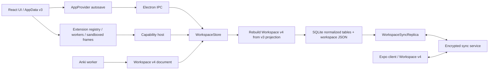

# NeoAnki Comprehensive Product and Engineering Audit

> **Remediation update (0.2.0):** The findings below describe the audited pre-fix state. Their implemented fixes, bounded-scope controls, and release evidence are tracked in [`neo-anki-audit-remediation-2026-07-19.md`](neo-anki-audit-remediation-2026-07-19.md). The original recommendation is retained as an immutable audit record; it is superseded only when the remediation ledger's release exit gate is green on the release commit.

**Audit date:** 2026-07-19
**Audited state:** local working tree based on `08abef4294b9558ee02878d21bc397af94113a5b` (`0.1.5`)
**Release recommendation:** **Do not release this working tree until the P0 findings and the data-model-dependent P1 findings are fixed.**
**Audience:** maintainers planning stabilization, migration, and future product work

> This report is a repair backlog, not a certification that no other defects exist. It combines code tracing, automated checks, targeted executable reproductions, product/UX review, and pedagogy review. The tree was materially dirty during the audit (97 tracked changes and 54 untracked entries), so the exact audited state is not reproducible from the base commit alone. Preserve or commit the audited changes before remediation begins.

## 1. Executive verdict

NeoAnki has a thoughtful foundation: transparent time-budget planning, explicit four-button self-grading, strong Anki preflight concepts, encrypted sync primitives, signed extension packages, sandboxed extension UI, and meaningful automated coverage. The current implementation nevertheless has a systemic persistence problem: Workspace v4 is described as the authority, while most product code edits an older `AppData` projection and reconstructs v4 during every desktop save. That reconstruction is lossy, revision-churning, and incompatible with retained review history.

Three directly reproduced failures make the current state unsuitable for release:

1. New reverse, cloze, and image-occlusion semantics plus citations, media links, and occlusions are lost after desktop save/reload.
2. Two rapid overlapping autosaves can conflict on an already-inserted review and silently leave the later review unpersisted.
3. Deleting a reviewed item fails the Workspace v4 invariant because Trash removes its cards but retains reviews that must reference live cards.

The same split model propagates into sync, extensions, shared packs, mobile, import/export, and analytics. Fixing isolated screens before resolving authority and transaction semantics will create more compatibility code and more data-loss paths. The first stabilization milestone should therefore establish one lossless domain authority and one serialized persistence command path.

### Release blockers at a glance

| ID | Severity | Finding | Status |
|---|---:|---|---|
| DATA-001 | P0 | Desktop v3→v4 reconstruction loses authored card/media/citation/occlusion semantics | Executably reproduced |
| DATA-002 | P0 | Overlapping autosaves can silently lose a rapid review | Executably reproduced |
| DATA-003 | P1 | Deleting a reviewed item fails; current Trash contract cannot satisfy v4 invariants | Executably reproduced |
| ARCH-001 | P1 | Two competing domain authorities create most persistence and sync defects | Confirmed by trace |
| SYNC-001 | P1 | A client outbox over 2,000 operations cannot be pushed | Confirmed by contract trace |
| SYNC-002 | P1 | A deleted entity cannot be restored through the client operation generator | Confirmed by contract trace |
| SYNC-003 | P1 | Page-by-page graph validation can reject a valid large remote change set | Confirmed by contract trace |
| EXT-001 | P1 | Renderer reload/re-enable leaves extension capability claims unusable | Confirmed by lifecycle trace |
| PACK-001 | P1 | Shared-pack deletion of reviewed content reproduces the orphan-review failure | Confirmed by shared code path |
| PED-001 | P1 | Desktop grading ignores imported per-preset learning settings | Confirmed by scheduler trace |
| PED-002 | P1 | Desktop sibling burying does not remove siblings already in the active queue | Confirmed by session trace |
| MOB-001 | P1 | Mobile sync and local saves can race and overwrite newer state | Confirmed by persistence trace |
| IMP-001 | P1 | Re-importing a modified export of the same Anki source duplicates its content | Confirmed by identity trace |
| IMP-002 | P1 | Import limits permit multi-gigabyte in-memory expansion and v4 envelope exhaustion | Confirmed by resource trace |
| PERF-001 | P1 | v3/v4 projection is superlinear and runs synchronously in important desktop paths | Confirmed by complexity trace |
| TEST-001 | P1 | Green tests do not exercise the ordinary-use durability failures above | Confirmed by coverage review |
| DOC-001 | P1 | Several public compatibility/durability claims exceed current evidence | Confirmed by docs/code comparison |

## 2. Scope and method

### In scope

- Web and Electron application code under `src/` and `electron/`
- Native Expo client under `apps/mobile/`
- Workspace compatibility domain, renderer, extension SDK, sync protocol/client/service packages
- Built-in trusted modules, Shared Packs, Browser Tab Sync, and the bundled Study Pulse SDK 2 example
- Anki current/legacy import, export, source retention, and oracle tests
- Persistence, sync, security boundaries, accessibility, usability, performance, pedagogy, tests, CI, release, and documentation

The separately maintained NeoAnki TTS repository was not present in this workspace and was **not re-audited**. Its historical assessment remains in the earlier audit, but its current code and compatibility cannot be asserted here. “Extensions” in this report means the extension platform and extensions/modules present in this repository.

### Method

- Mapped state and trust boundaries from UI action through persistence/sync.
- Read core storage, scheduler, importer/exporter, sync, extension, and mobile paths.
- Ran all available local quality gates listed below.
- Wrote disposable executable reproductions against the real desktop store for the three data findings.
- Compared declared claims and remediation status with observable behavior.
- Reviewed the primary user journeys against accessibility and learning-design heuristics.

### Severity and confidence

| Level | Meaning |
|---|---|
| P0 | Ordinary-use silent data loss/corruption or a broken durability guarantee; stop release |
| P1 | Release-blocking integrity, security-boundary, compatibility, or core learning defect |
| P2 | Material correctness, scale, operability, pedagogy, or UX weakness |
| P3 | Lower-risk hardening, maintainability, polish, or evidence gap |

“Reproduced” means an executable local scenario observed the failure. “Confirmed” means the relevant producer and consumer contracts were traced and cannot satisfy the stated behavior. “Risk” means plausible but requiring broader fixtures, devices, deployment conditions, or adversarial testing.

## 3. Architecture and trust-boundary map

The architectural fault line is the left side: imported and synced data use v4, but desktop UI actions usually mutate v3. Every save then tries to infer the richer v4 graph from the poorer projection. Fields with no v3 representation cannot survive, and every reconstruction fabricates new revisions even when entities did not change.

## 4. Validation baseline

| Check | Result | Important qualification |
|---|---|---|
| ESLint | Pass | Static style/type-adjacent checks only |
| TypeScript | Pass | Cannot detect semantic projection loss |
| Unit/integration tests | 154/154 pass in 43 files | 76.25% statements; important packages/apps excluded from coverage |
| Time-zone suite | 15/15 in New York and Kyiv | Good boundary coverage, not a full scheduler oracle |
| Browser E2E | 16/16 | Chromium plus iPhone emulation only; localStorage adapter rather than desktop store |
| Desktop E2E | 8 pass, packaged-launch test skipped locally | Does not test rapid reviews, reviewed deletion, or new-feature round trips |
| Production build | Pass | Main JS 654.08 kB minified / 194.76 kB gzip; chunk warning |
| Planner benchmark | Pass | 50,000 cards in 722 ms; does not include v3/v4 reconstruction |
| License policy | Pass | Nine declared shipping runtime packages checked by the policy script |
| Extension package check | Pass | Study Pulse manifest/schema/package validates; host lifecycle is not exercised |
| Mobile export | Pass | iOS and Android bundles generated, about 3.9 MB each |
| Expo Doctor | 20/20 pass | Dependency/config health, not native behavior |
| `npm audit` | 11 moderate, 0 high/critical | Expo/mobile chain; CI intentionally blocks only high severity |
| Anki oracle | Not exercised locally | Tests return early when Python/Anki is unavailable and still appear as passes |

### Positive controls worth retaining

- Extension UI is sandboxed without same-origin, CSP blocks network access, and capability checks are repeated at the host boundary.
- Extension archives are path/size bounded and signatures cover reproducible package bytes.
- Desktop sync keys use secure storage where available; the protocol encrypts content and authenticates operations.
- Anki source archives are verified and fsynced during retention, and destructive import requires preflight acceptance.
- The learning UI uses explicit ratings, does not auto-grade from time, exposes heuristic planning as heuristic, and renders only the selected cloze target.
- AppShell focus management, modal focus trapping, reduced-motion CSS, and light/dark axe smoke checks provide a good accessibility base.

## 5. Detailed findings

### 5.1 Domain authority, persistence, and data integrity

#### DATA-001 — P0 — Rich authored content is lost on desktop reload

**Evidence.** A disposable `WorkspaceStore` was seeded, then given reverse/cloze/image-occlusion cards, a citation, media linkage, and an occlusion. After save/reload the three variants were all `forward`, citations were empty, `mediaIds` were empty, and occlusions were empty, although the raw asset remained stored. `refreshWorkspaceDocumentV4FromProjection()` in `src/lib/workspace-v4.ts` maps projected cards to the first Neo Basic template and does not preserve `variant`, `promptData`, `occlusionId`, citations, media links, or new source/provenance semantics unless they already exist in a legacy envelope.

**Impact.** Users can create apparently successful learning material and lose its meaning after restart. Assets can become retained but unreachable.

**Required fix.** Stop reconstructing authoritative v4 entities from `AppData`. Prefer v4-native commands and selectors. If a transitional adapter is unavoidable, make it a formally lossless round trip with explicit representations for every v4 field and fail closed when it cannot preserve one.

**Acceptance.** A desktop integration matrix must create, edit, save, restart, export, sync, and re-open every supported card variant, multiple cloze ordinals, occlusions, citations, media links, source/provenance, deck/preset, and unknown inert envelope; normalized canonical documents must remain equivalent.

#### DATA-002 — P0 — Overlapping autosaves can lose rapid reviews

**Evidence.** Two saves were initiated from the same persisted base: state A contained review A, then state B contained A+B. The main-process queue serialized writes, but the second diff still compared with the stale base and attempted to insert A again. SQLite rejected it with `UNIQUE constraint failed: reviews.id`; only A was stored. `src/state/AppContext.tsx` launches saves from a data-dependent effect without awaiting/coalescing them. `lastPersisted` in `src/lib/storage.ts` advances only after the request completes, while the Electron queue serializes stale complete-document diffs rather than rebasing them.

**Impact.** A user grading quickly can see a successful UI transition while the later review and schedule are absent after restart. The persistence error is surfaced only in Settings.

**Required fix.** Introduce one ordered persistence coordinator. Queue domain commands or snapshots with monotonic versions, coalesce pending snapshots, rebase after each committed result, and never diff from a stale acknowledged base. Make review+journal+schedule an atomic idempotent command. Block or visibly degrade further grading when persistence fails.

**Acceptance.** A deterministic delayed-IPC test must issue hundreds of grades and edits faster than storage latency, inject retryable failures, restart at every boundary, and prove exactly-once review IDs, correct final schedules, no hidden error, and no duplicate operation generation.

#### DATA-003 — P1 — Reviewed content cannot be moved to Trash

**Evidence.** Deleting a seeded item after appending a review produced `Workspace v4 invariant violation: reviews[0].cardId: Missing card`. The AppContext delete command removes item/cards and records a Trash payload while retaining review history. Workspace v4 requires every review to reference a live card. The SQLite review table intentionally has no card foreign key, so the storage and domain contracts disagree.

**Impact.** A common operation fails after study. The promise that Trash preserves review history cannot be implemented by the current graph.

**Required fix.** Choose and document one model: tombstoned notes/cards remain addressable until purge; reviews carry immutable historical card snapshots; or reviews may reference tombstones. Apply the same rule to direct deletion, pack deletion, sync deletion, restoration, purge, export, and analytics.

**Acceptance.** Review → trash → restart → sync → restore → restart must retain history and restore the same IDs/schedule. Purge behavior must be explicit and tested.

#### ARCH-001 — P1 — Workspace v4 and AppData v3 are competing authorities

**Evidence.** `docs/anki-compatibility.md` calls v4 the durable authority. Most React code edits v3, while `electron/workspace-store.ts` reconstructs v4 before persistence. The adapter increments note, card, preset, and media revisions on save even when their semantic content did not change.

**Impact.** Data loss, false sync operations, false conflicts, high write amplification, and cross-client drift are structural rather than isolated bugs.

**Required fix.** Define Workspace v4 domain commands as the only mutation API. Keep v3 only as a read projection during migration, add a deprecation boundary, and delete reverse projection code once all screens are migrated. Revisions must change only when the canonical entity changes.

**Acceptance.** A documented authority invariant, architecture test forbidding UI writes to v3, canonical equality tests, and unchanged-save tests that emit zero entity revisions/operations.

#### ARCH-002 — P2 — Graph invariants are incomplete and not robustly typed

`packages/compatibility-domain/src/invariants.ts` primarily validates references. It does not fully enforce profile ownership across edges, deck acyclicity, unique template ordinals, exact required fields, card/template ordinal consistency, one active profile, or source identity uniqueness. Malformed primitives can escape into raw exceptions rather than structured diagnostics.

**Fix/acceptance.** Publish the graph invariants as schema plus semantic checks, return bounded structured issues for every invalid input, fuzz the validator, and add negative fixtures for cross-profile edges, cycles, duplicate ordinals, missing/extra fields, invalid timestamps/revisions, and malicious envelope values.

#### DATA-004 — P2 — Extension media accessibility metadata is transient

`WorkspaceStore.createExtensionMedia()` accepts `altText`, but the v4 `MediaAsset` and stored source envelope do not preserve it. Reload therefore loses the text.

**Fix/acceptance.** Add durable localized media descriptions or attach alt text at each content reference; test SDK create → reload → render → export/import.

#### DATA-005 — P2 — SDK patch idempotency is syntactic only

`applyWorkspacePatchV2()` requires a nonempty `idempotencyKey` but stores no applied-key ledger. Repeating the same request can conflict or repeat effects.

**Fix/acceptance.** Persist `(extension, key, result hash/status)` transactionally with the patch and return the original result on replay. Test restart and concurrent duplicate delivery.

### 5.2 Sync and distributed state

#### SYNC-001 — P1 — Outboxes over 2,000 operations cannot progress

The service rejects a push over 2,000 operations (`packages/sync-service/src/index.ts`); the client submits its entire outbox in one request (`packages/sync-client/src/index.ts`). Revision churn makes this reachable from comparatively small edits/imports.

**Fix/acceptance.** Send bounded, causally ordered, retryable chunks with per-chunk acknowledgements and resumable cursors. Test 2,001, 10,000, and interrupted 100,000-operation backlogs under duplicate delivery.

#### SYNC-002 — P1 — Delete-wins restoration is unreachable

The protocol requires an explicit `restore` operation to supersede a tombstone, but `createLocalOperations()` emits only `upsert` for present entities and `delete` for absent ones. Reappearance after Trash restore remains deleted on replicas that observed the tombstone.

**Fix/acceptance.** Track tombstone state and emit authenticated restores with a defined authorization/version rule. Add two- and three-device delete/edit/restore permutations, including offline devices.

#### SYNC-003 — P1 — Valid large graph updates can fail at page boundaries

Remote operations are pulled in pages and `WorkspaceSyncReplica.applyBatch()` validates the full graph after each page. A coherent update split between a referencing entity and its dependency—or a large deletion set—can be transiently invalid and permanently retry.

**Fix/acceptance.** Apply a complete server transaction/checkpoint atomically, or defer graph validation until all causally related pages are staged. Never expose partially applied state. Test adversarial splits at every operation boundary.

#### SYNC-004 — P2 — Review order is not a domain invariant

Ledger projection sorts by kind/ID, while undo and pace calculations consume array order (`reverse()` and `slice(-100)`) as chronology. Imported and synced review IDs are not guaranteed chronological. A latest non-reversible imported event can also stop desktop undo before an earlier reversible local event.

**Fix/acceptance.** Define review order by HLC/event timestamp plus deterministic tie-breaker and query explicitly. Define whether undo means latest local reversible action or latest global event. Test shuffled IDs and concurrent reviews.

#### SYNC-005 — P2 — `clientState` is an oversized conflict unit

Settings, goals, views, packs, Trash, and other client state share one synced field. Independent offline changes therefore conflict, and selecting either version can discard unrelated state.

**Fix/acceptance.** Normalize independently editable records with per-entity revisions and merge rules. Add offline concurrent changes to unrelated goals/settings/packs and prove both survive.

#### SYNC-006 — P2 — The operation ledger can partially mutate before rejecting an invalid review mutation

Actor sequence/applied-operation bookkeeping advances before the append-only review check. `applyBatch()` is not transactional in memory.

**Fix/acceptance.** Prevalidate or clone/stage the entire batch and commit only after all protocol and graph checks pass. Assert byte-for-byte ledger equality after every rejected batch.

#### SYNC-007 — P2 — Remote clock skew is unbounded

An authorized malfunctioning device can emit a far-future HLC wall time and win last-writer resolution for an extended period.

**Fix/acceptance.** Add server/client skew policy, quarantine, diagnostics, and a recovery mechanism; test extreme past/future clocks without making legitimate offline devices unrecoverable.

#### OPS-001 — P2 — Sync abuse and durability controls are not production-complete

Rate limiting is in-memory/per-process; unauthenticated account creation has no durable global quota/expiry policy; response bodies are buffered without client-side size bounds. Service backup/restore, multi-process limiting, load, and disaster-recovery behavior were not demonstrated.

**Fix/acceptance.** Add shared ingress limits, account/storage quotas, response caps, metrics/alerts, encrypted backup restore drills, and load/fault tests. Keep the existing recommendation for external ingress limits.

### 5.3 Extension platform and bundled modules

#### EXT-001 — P1 — Renderer reload breaks extension capabilities

`ExtensionServices.claim()` keeps capability claims for the process lifetime. Renderer capability tokens are module-local and reset on `webContents.reload()`. The reload path does not invalidate/reissue service claims. Registry initialization catches the failed claim and can still create a worker, but host calls have no valid capability token. Disable/re-enable and update share the lifecycle risk.

**Fix/acceptance.** Model instance ownership explicitly: revoke claims on renderer teardown, issue fresh tokens per instance, and require successful capability initialization before reporting the extension running. Test reload, crash recovery, disable/enable, upgrade, rollback, and two windows.

#### EXT-002 — P2 — Extension diagnostics grow without bound

Registry diagnostics are appended to a process-lifetime array. A noisy/restarting extension can cause unbounded memory and Settings payload growth.

**Fix/acceptance.** Use a timestamped ring buffer with per-extension quotas and persisted diagnostic export.

#### EXT-003 — P2 — SDK content paging still builds the whole expensive projection

`content.listNotes` projects the entire Workspace v4 graph before slicing a page, so pagination does not cap CPU/memory.

**Fix/acceptance.** Query normalized canonical entities with indexed cursor pagination and a total work budget. Benchmark realistic 100k/1m-card workspaces.

#### EXT-004 — P3 — Version precedence is not SemVer-correct

Package downgrade detection compares only the first three numeric components and ignores prerelease precedence.

**Fix/acceptance.** Use one audited SemVer implementation and fixtures such as `1.0.0-beta.2`, `1.0.0-beta.11`, `1.0.0`, and build metadata.

#### PACK-001 — P1 — Shared-pack deletes fail for reviewed content

Direct patch deletion and upstream `$delete` conflict resolution remove the item/cards while preserving reviews, triggering DATA-003 at save. Upstream-delete conflict resolution also leaves subscription mappings/base items stale.

**Fix/acceptance.** Route every deletion through the canonical tombstone/Trash command and update pack mappings transactionally. Test reviewed subscribed items across apply, conflict, restart, sync, restore, unsubscribe, and purge.

#### PACK-002 — P2 — Pack cloze representation cannot preserve multiple cloze ordinals

Pack variants are unique by variant name and carry no ordinal-specific `promptData`; materialization creates one cloze card and the renderer selects the first ordinal. Multi-deletion cloze notes cannot be faithfully shared.

**Fix/acceptance.** Give pack cards stable IDs and complete per-card prompt data, including cloze ordinal. Round-trip a note with repeated and multiple cloze numbers.

#### MOD-001 — P3 — Browser Tab Sync is an advertised no-op boundary

`src/extensions/tab-sync/transport.ts` returns `null`, while documentation presents tab sync as a trusted module.

**Fix/acceptance.** Implement and test the transport or remove the feature from claims/navigation until it exists.

### 5.4 Scheduling, learning design, and analytics

#### PED-001 — P1 — Desktop grading ignores imported preset scheduling

Desktop calls `scheduleReview(card, rating, current.settings.retention)`, whose current implementation uses global retention and fixed learning/relearning steps. It does not use the card’s imported preset retention, learning steps, relearning steps, or maximum interval. Mobile does consult per-deck presets, so the same card diverges by client after the first grade.

**Impact.** Imported scheduling continuity is retained only until the user studies on desktop.

**Fix/acceptance.** Resolve one canonical scheduling context from card→deck→preset on every client and feed it into a shared scheduler package. Differential tests must produce identical next state on desktop/mobile for all ratings, learning/relearning states, maximum intervals, DST, and imported scheduling metadata.

#### PED-002 — P1 — Desktop sibling burying is ineffective inside the current session

Rating updates sibling cards to `buried`, but `ReviewPage` walks a queue built at session start and does not skip cards whose status later became buried/suspended. A sibling already queued can still be shown the same day. Mobile recomputes due cards and behaves differently.

**Fix/acceptance.** Make the queue a derived/cursor view that rechecks eligibility before display, or remove newly ineligible IDs after every command. Test forward/reverse siblings and multi-ordinal clozes across grades, undo, restart, and day rollover.

#### PED-003 — P2 — Desktop planning ignores deck/preset daily limits

The desktop planner applies a global time budget but not imported `newCardsPerDay`/`reviewsPerDay`; mobile applies preset limits. Card-level deck membership is also collapsed into `item.collection` from the first card, so sibling cards in different decks can be filtered and counted under the wrong deck.

**Fix/acceptance.** Define a shared queue policy that composes time budget, per-deck limits, presets, burying, and explicit overrides. Preserve card-level deck identity through projections.

#### PED-004 — P2 — Preview practice contaminates real review evidence

Preview ratings create ordinary review events and feed scheduler/Insights/planner calculations even when the user is merely testing authored content.

**Fix/acceptance.** Add an explicit event purpose (`scheduled`, `preview`, `cram`, `migration`, `undo`) and exclude or separately report non-scheduled events. Make the choice visible before practice.

#### PED-005 — P2 — Learning metrics are inconsistent across clients

Desktop completion/Insights treats Hard, Good, and Easy as success (`rating > 1`), while mobile statistics use Good/Easy as successful recall. Desktop duration measures prompt-to-grade active time; mobile resets its timer at reveal and therefore measures feedback-to-grade time. Synced analytics are not comparable.

**Fix/acceptance.** Write a metric dictionary: observed recall, lapse, completion, active recall latency, feedback time, and total handling time. Store the necessary timestamps and use the same definitions in all clients and docs.

#### PED-006 — P2 — Queue cost is a heuristic without calibration evidence

Fixed new-card and future-review costs do not simulate repeated same-day learning/relearning steps, and long budgets can introduce many new cards without an explicit cap. The UI correctly labels the plan heuristic, but there is no calibration against actual completion, retention, or user fatigue.

**Fix/acceptance.** Keep the explanation, add configurable new-card constraints, model expected same-day repetitions, and evaluate forecast error on opt-in anonymized/local datasets before making stronger efficacy claims.

#### PED-007 — P2 — Typed-answer gating creates an avoidable retrieval barrier

Reveal is blocked until the field is nonblank. A learner who cannot recall must type arbitrary text rather than honestly reveal, adding friction and low-quality data.

**Fix/acceptance.** Allow “I don’t know / reveal blank” as an explicit, keyboard-accessible action and record it distinctly if typed-answer quality is analyzed.

#### PED-008 — P2 — Undo semantics are fragile after import/sync

Desktop undo stops at the latest non-reversed event even when that event has no reversible previous-card snapshot, so a migration/import event can block an earlier local undo. Mobile also relies on array order rather than explicit chronology.

**Fix/acceptance.** Define undo as a local command stack with persisted inverse data, independent from historical review ordering. Specify sync propagation and cross-device conflict behavior.

### 5.5 Mobile correctness and parity

#### MOB-001 — P1 — Sync can race the mobile save queue

Today/Library mutations use a local promise queue, but foreground automatic sync and the Sync screen save returned documents outside that queue using captured document state. A sync result can overwrite a newer local mutation, or a later stale queued save can overwrite sync. Optimistic persistence failures in primary screens are not surfaced reliably.

**Fix/acceptance.** Put local commands, sync merges, configuration, and persistence behind one versioned repository/transaction actor. Reject stale snapshot commits and expose a durable unsaved/error state. Test delayed saves, foreground transitions, double taps, offline/online flapping, process death, and full storage.

#### MOB-002 — P2 — Rating submission is not guarded against repeated taps

The native grading buttons have no in-flight guard. Two taps can compute from the same props/queue and race state/persistence, producing misleading navigation or last-write behavior.

**Fix/acceptance.** Disable grading immediately after acceptance, dedupe by command ID, and restore controls only on an explicit retryable failure.

#### MOB-003 — P2 — Native accessibility and real-device behavior are unverified

Expo Doctor and bundle export pass, but no VoiceOver/TalkBack, dynamic type, keyboard/switch access, low-memory import, background lifecycle, or real-device offline/sync suite was found.

**Fix/acceptance.** Add a device matrix and manual/automated accessibility checklist; include at least iOS and Android screen readers, 200% font scaling, dark mode, slow storage/network, and process termination.

### 5.6 Anki compatibility and import/export

#### IMP-001 — P1 — Modified repeat imports duplicate the same source

Anki entity IDs are prefixed with a digest of the entire package. An exact file is deterministic, but any changed export of the same collection gets a new prefix and duplicates all notes/cards rather than matching stable Anki note GUID/source identity. The documentation’s repeat-import claim is therefore too broad.

**Fix/acceptance.** Define stable source/profile identity and entity matching, then implement additive update/conflict behavior. Test exact repeat, one-note edit, scheduling-only change, media-only change, export/repack differences, and independent collections with colliding local numeric IDs.

#### IMP-002 — P1 — Import resource bounds still permit process exhaustion

The worker first materializes the compressed file, then all expanded ZIP entries, SQLite rows, media data URLs, v4 entities, and retained source data. Current limits allow 512 MB compressed and 2 GB expanded input. Table readers use `SELECT *` into arrays. Workspace v4 allows only 100,000 source envelopes even though a mature collection can create an envelope per entity/row. A 50,000-entry filename list or large opaque record can also exceed the per-envelope limit.

**Fix/acceptance.** Stream ZIP entries and SQLite rows into bounded staging storage, avoid media data URLs, enforce a preflight memory/disk budget, aggregate source fidelity without one envelope per row, support cancellation, and test near-limit collections under constrained memory. Reject predictably before allocation.

#### IMP-003 — P2 — `.colpkg` “profile replacement” replaces the entire workspace

The replace path swaps the whole Workspace v4 document, not only the active profile. NeoAnki goals, views, packs, Trash, and settings can be discarded, while UI text describes an imported profile becoming active.

**Fix/acceptance.** Either implement scoped profile replacement with an explicit merge plan or rename the action “replace entire workspace,” enumerate every category to be removed, produce a verified backup, and provide one-click rollback.

#### IMP-004 — P2 — Compatibility/fidelity claims exceed the exporter model

The importer retains substantial source data, but export rebuilds a known Anki schema and cannot demonstrate byte/semantic round-trip for every unknown normalized/protobuf row/config. ZIP64 is unsupported, large archives/timeouts are bounded, and some reviews without known cards are skipped. These are valid product limits but need precise disclosure.

**Fix/acceptance.** Publish a versioned compatibility matrix by Anki version, schema, package type, scheduler state, template/media feature, and limit. Distinguish “retained inertly” from “re-emitted on export.” Add golden semantic diffs using Anki itself.

#### TEST-002 — P2 — The local Anki oracle can report a pass without running

Oracle and large-media tests return early when Python/Anki is unavailable rather than registering a skip/failure. The fallback includes a developer-specific absolute path. CI installs pinned Anki 25.9.4, but the corpus is small and version-narrow.

**Fix/acceptance.** Mark explicit skips locally, require the oracle in compatibility/release jobs, remove personal paths, record oracle versions, and grow a licensed/generated multi-version corpus with scheduling, HTML/CSS, cloze, media, filtered decks, and damaged-file cases.

### 5.7 UX, accessibility, and performance

#### UX-001 — P2 — Persistence failures are not visible where data is created

The central persistence error is displayed in Settings rather than as a blocking/retryable status in Review, Create, Library, or import flows. This turns DATA-002 into silent loss.

**Fix/acceptance.** Add global save state (`saving`, `saved`, `offline`, `failed`, `retrying`) with contextual recovery. Never advance an irreversible workflow without a durable command acknowledgement unless the UI clearly labels it pending.

#### A11Y-001 — P2 — Dense desktop styling undermines readability and target size

Later compact CSS uses many 25–34 px controls and microcopy down to roughly 0.54–0.7 rem. Some responsive rules restore larger controls, but the desktop density is difficult for low-vision and motor-impaired users and is not covered by target-size tests.

**Fix/acceptance.** Establish design tokens with a 16 px body baseline, readable secondary text, at least 24×24 px WCAG minimum and preferably 44×44/48×48 for touch-primary actions, 200% zoom reflow, and automated contrast/target audits on every route.

#### A11Y-002 — P2 — Imported-card frames can produce clipped/nested-scroll content

The desktop card frame uses a fixed large height and imported CSS can change internal layout. Long cards, large type, tables, and media can become nested-scroll or clipped experiences.

**Fix/acceptance.** Use a constrained, measured resize protocol from the sandbox; cap pathological size; preserve keyboard focus; and test very long cards, 200% zoom, RTL, formulas, tables, and media.

#### A11Y-003 — P3 — Progress semantics and motion preferences are inconsistent

The review progressbar reports `index + 1` before the card is graded while the visual fill begins at zero. Programmatic `scrollTo({behavior: 'smooth'})` does not consult reduced-motion preference.

**Fix/acceptance.** Define progress as completed cards, align text/ARIA/visual values, and centralize motion helpers that honor `prefers-reduced-motion`.

#### UX-002 — P3 — Routes have no durable URL/history model

Route state is in React memory. Reload/back/deep-link/bookmark behavior is unavailable, and extension destinations cannot be shared reliably.

**Fix/acceptance.** Add a small typed router with safe extension routes, history semantics, reload restoration, focus/announcement on navigation, and malformed-route handling.

#### PERF-001 — P1 — Projection complexity is superlinear

`workspaceDocumentV4ToAppData()` repeatedly scans cards/reviews inside note/card loops (`find`, `filter`), making projection roughly O(notes×cards + cards×reviews). Rebuilding the reverse projection also touches and revises nearly all entities. These paths run in desktop startup/save and extension queries; the planner-only 50k benchmark does not measure them.

**Fix/acceptance.** Remove reverse reconstruction; index entities by ID/foreign key for any remaining projection; make large work asynchronous/cancellable; benchmark cold open, one grade, one edit, sync diff, and extension paging at 50k, 100k, and 1m cards with memory ceilings.

#### PERF-002 — P2 — Analytics repeatedly scans full review history

Insights performs repeated filters by deck/day across review history. Large imported histories can block rendering even if the visible window is limited.

**Fix/acceptance.** Maintain/query indexed aggregates, compute off the render thread, and set latency budgets for initial and filtered Insights views.

#### PERF-003 — P3 — Main web bundle exceeds the configured chunk warning

The production main bundle is about 654 kB minified. This is not itself a correctness defect, but it increases startup/parse cost and makes route isolation harder.

**Fix/acceptance.** Measure startup first, then lazy-load import/export, charts, extension management, and other non-critical routes with bundle budgets in CI.

### 5.8 Tests, CI, release, documentation, and dependencies

#### TEST-001 — P1 — Current green gates miss the critical persistence contract

Vitest coverage excludes sync packages/service, substantial mobile state/storage/sync code, and many pages/components. Browser E2E uses the web/localStorage adapter, so it cannot catch desktop v3→v4 loss. Desktop E2E covers basic persistence/import but not new variants/citations/media/occlusion, reviewed deletion, overlapping saves, extension reload tokens, sync limits, or tombstone restore.

**Fix/acceptance.** Add the scenario matrix in section 7 before changing implementation. Make every confirmed defect fail on the current code. Measure domain/package coverage separately rather than relying on aggregate line coverage.

#### CI-001 — P2 — Browser and native compatibility matrices are narrow

Playwright runs Chromium and iPhone emulation only; CI installs WebKit but does not use it. There is no Firefox, Safari/WebKit journey coverage or native device behavior suite.

**Fix/acceptance.** Run a risk-based Chromium/WebKit/Firefox matrix on core web flows and real/simulated native lifecycle tests. Remove unused installs if a browser is intentionally unsupported.

#### REL-001 — P1 — Release jobs do not independently rerun critical E2E durability gates

The release verification job runs build/unit/static/package checks but not the browser or full desktop E2E suite; packaged launch is only a shallow smoke in build jobs. A tag can therefore be published without the release workflow itself proving storage and extension journeys.

**Fix/acceptance.** Gate artifacts on the exact commit passing desktop persistence, extension lifecycle, web journey, compatibility oracle, migration, and packaged-app tests. Generate an immutable evidence manifest with versions/hashes.

#### DOC-001 — P1 — Claims and remediation status are ahead of implementation

Examples include “Workspace v4 durable authority,” “atomic review transaction,” append-only convergent reviews, deterministic repeat-import identity, bounded/incremental import implications, and SDK 2 capability continuity. `docs/claim-evidence.md` points to the earlier audit/remediation state but does not account for the regressions confirmed here.

**Fix/acceptance.** Downgrade claims immediately, then require each strong claim to link to a current automated acceptance test and known limits. Treat claim-evidence review as a release gate.

#### DEP-001 — P2 — Eleven moderate advisories remain in the Expo/mobile chain

`npm audit` reports 11 moderate vulnerabilities and no high/critical ones. CI’s high-only threshold therefore passes by policy. The automatic suggestion is a disruptive/incorrectly regressive Expo change, so remediation needs manual dependency analysis rather than blind application.

**Fix/acceptance.** Record each advisory’s reachability, shipped surface, upstream status, compensating control, and expiry date; upgrade through a tested supported Expo path. Keep lockfile/SBOM and exception review in release evidence.

#### SEC-001 — P2 — Browser key storage has an undocumented same-origin boundary

Browser sync stores recovery/session material and usable non-extractable CryptoKeys in IndexedDB. Non-extractability prevents raw-key export but does not prevent same-origin script execution from using the keys or reading ciphertext/session state.

**Fix/acceptance.** Document this threat boundary, maintain strict CSP/dependency hygiene, clear sessions predictably, and decide whether browser sync is supported for high-sensitivity data. Add XSS-oriented security review and dependency provenance controls.

## 6. Root causes

1. **Projection-first architecture.** A convenience UI model became a mutation authority despite being unable to represent the imported/synced domain.
2. **Whole-document optimistic persistence without versions.** Independent effects submit stale snapshots while storage assumes a coherent diff base.
3. **Cross-client policy duplication.** Desktop and mobile independently implement queueing, scheduling context, timing, undo, and success metrics.
4. **Graph validity applied at the wrong granularity.** Delete, sync pages, and pack patches mutate pieces while invariants require a coherent whole graph.
5. **Claims based on component properties rather than end-to-end journeys.** Encryption, signatures, source retention, and unit coverage are real, but do not prove lifecycle/durability/round-trip behavior.
6. **Scale tests target the planner, not the dominant projection/import/sync costs.** The measured fast component is not the current bottleneck.

## 7. Required regression and acceptance matrix

These tests should be added first and must fail against the audited state where noted.

| Journey | Required assertions |
|---|---|
| Rich authoring round trip | Every variant, cloze ordinal, occlusion, citation, media reference/alt, source and provenance survives restart/export/import/sync |
| Rapid grading under slow disk | Exactly-once reviews and correct final schedule; visible retry/failure; restart at every command boundary |
| Trash lifecycle | Reviewed item/card deletion, restart, sync, restore, purge, analytics, and export follow one documented history rule |
| Unchanged save | Zero semantic revisions, zero sync operations, stable canonical bytes except permitted metadata |
| Imported first grade | Desktop and mobile produce identical results from every preset/rating/state/time zone |
| Sibling bury | No newly buried sibling appears in the active session on either client |
| Sync backlog | 100k ops upload/download with interruption, replay, duplicate requests, and bounded memory |
| Sync graph pages | Adversarial page splits never expose or reject a coherent final graph |
| Delete/restore conflicts | Multi-device offline permutations converge and restoration is expressible |
| Extension lifecycle | Install, capability call, reload, crash, re-enable, update, rollback, and uninstall |
| Extension patch replay | Same idempotency key across concurrent delivery and process restart applies once |
| Shared packs | Reviewed content deletion/conflict/restore and multi-ordinal cloze remain valid |
| Mobile persistence | Local edits + foreground sync + process death + full disk never silently regress document version |
| Repeat Anki import | Exact, content-modified, schedule-modified, media-modified, and repacked sources update rather than duplicate |
| Large Anki import | Bounded memory/disk, cancellation, predictable preflight rejection, oracle verification |
| Accessibility | Every route at light/dark, keyboard, screen reader, reduced motion, 200% zoom/font, narrow viewport |
| Release artifact | Packaged app opens, persists rich content, runs extension, imports/exports fixture, syncs, and matches artifact hash |

## 8. Remediation roadmap

### Wave 0 — Contain risk and pin evidence (1–3 days)

- Freeze release and avoid importing valuable production collections into this worktree.
- Preserve the exact dirty state in a reviewable commit/branch or patch bundle.
- Add failing tests for DATA-001, DATA-002, and DATA-003 before implementation.
- Correct the strongest claims in README and `docs/claim-evidence.md`.
- Add a visible global persistence failure state as a temporary safety net.

### Wave 1 — Establish canonical data and transactions (large; highest dependency)

- Make Workspace v4 the only mutable domain authority.
- Define tombstone/history/restore/purge semantics.
- Introduce typed, idempotent domain commands and one ordered persistence coordinator.
- Make revisions content-sensitive; remove whole-graph reverse reconstruction.
- Harden schemas/invariants and add migration/rollback tooling.

**Exit gate:** rich round trips, rapid grading, Trash lifecycle, unchanged saves, and crash recovery all pass.

### Wave 2 — Make sync converge at scale

- Chunk/acknowledge outboxes, stage atomic remote batches, implement restore, and make ledger application transactional.
- Normalize client state and define review chronology/undo.
- Add skew, quota, response-bound, backup, and operational controls.

**Exit gate:** the 100k-operation, page-split, offline conflict, delete/restore, and fault-injection suites pass.

### Wave 3 — Unify the learning engine

- Share scheduler context, queue policy, limits, burying, timing, metrics, and undo between clients.
- Separate scheduled review from preview/cram/migration events.
- Preserve card-level deck/preset identity.
- Add honest blank reveal and evaluate planner calibration.

**Exit gate:** differential desktop/mobile tests are identical and the metric dictionary is implemented.

### Wave 4 — Repair extension, packs, mobile, and Anki lifecycle

- Fix capability instance lifecycle and persisted SDK idempotency.
- Route pack mutations through canonical commands; expand pack card representation.
- Put mobile persistence/sync behind the same versioned repository semantics.
- Implement stable Anki source identity and bounded streaming import.

**Exit gate:** lifecycle and compatibility rows in section 7 pass against packaged artifacts and native builds.

### Wave 5 — Evidence, UX, accessibility, and production readiness

- Expand browser/device/accessibility matrices and performance budgets.
- Optimize indexed projections/analytics and split bundles based on measurement.
- Complete service load/DR/security review and dependency exceptions.
- Link every product claim to current evidence and publish precise compatibility limits.

## 9. Fix-order dependency notes

- Do not repair individual v3 adapter field losses before deciding ARCH-001; that creates another temporary schema to migrate.
- Do not finalize sync delete/restore until DATA-003’s review-history model is chosen.
- Do not tune planner forecasts until shared scheduler context and event-purpose semantics exist.
- Do not optimize current whole-document reconstruction as the primary solution; remove it, then benchmark the remaining projection.
- Do not declare extension lifecycle fixed from package validation alone; test a real capability across renderer teardown.
- Do not broaden Anki compatibility claims from a single pinned oracle version; publish the exact matrix actually exercised.

## 10. Definition of a stabilization release

A stabilization release is ready only when:

- All P0 and P1 items are fixed or explicitly removed from supported product behavior.
- The acceptance rows in section 7 run on the release commit and packaged artifacts.
- Workspace canonical migrations are versioned, backed up, reversible, and tested from every supported prior format.
- Desktop and mobile scheduler/metric differential tests agree.
- Sync passes long-backlog, conflict, restore, retry, and fault-injection suites.
- The Anki compatibility page states exact versions/features/limits and the required oracle passes.
- Persistence or sync failure is visible and recoverable at the point of action.
- Accessibility is checked across every primary route and both native platforms.
- `docs/claim-evidence.md` is regenerated from current tests rather than inherited remediation status.
- The source tree is clean and the audit-to-fix mapping is recorded in issues/commits.

## 11. Suggested issue split

Create one tracking epic per remediation wave and individual issues for each ID. Every issue should include:

- the evidence/reproduction from this report;
- the domain contract being changed;
- migration and rollback implications;
- desktop, web, mobile, sync, extension, and Anki impacts;
- the exact acceptance row(s) it closes;
- documentation/claim changes;
- performance and accessibility checks where applicable.

The first implementation issue should be **“Canonical Workspace v4 command and persistence boundary”**, with DATA-001/002/003 as mandatory red tests. That work unlocks most of the rest of the backlog and prevents fixes from being built on another lossy projection.
